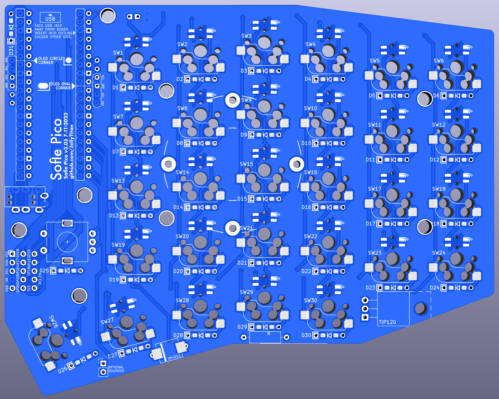
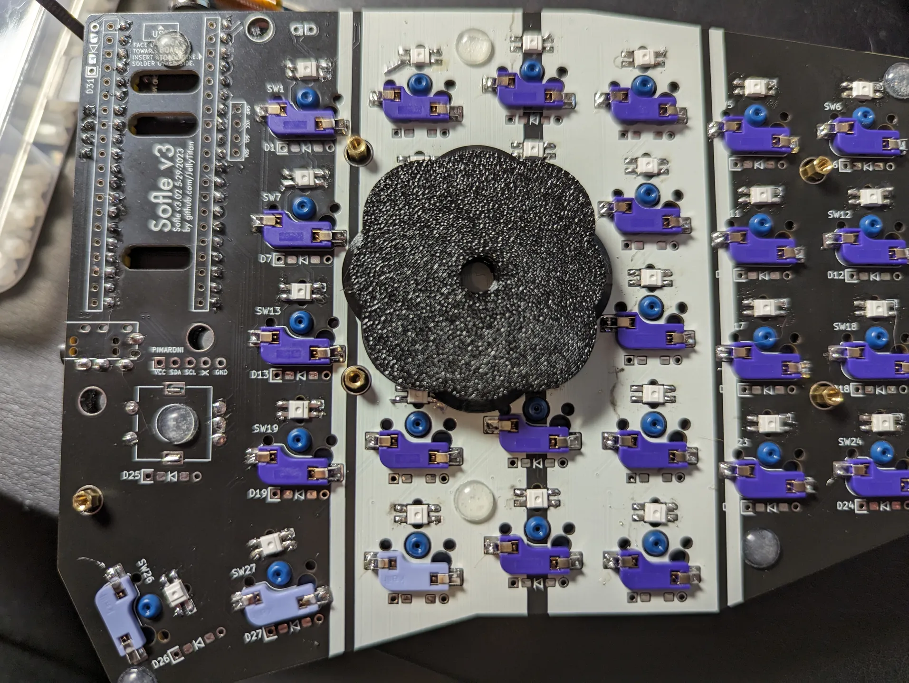
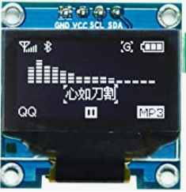
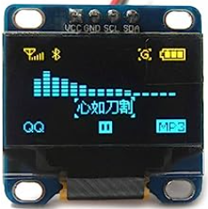

# Sofle Pico Keyboard
Sofle is 6×4+5 keys column-staggered split keyboard with encoder support, per-key RGB, dual 128x64 OLEDs, and uses the RP2040 based Pi Pico MCU. 

The Sofle Pico was designed by [Ryan Neff](https://github.com/JellyTitan), based on the excellent Sofle Choc designed by [Brian Low](https://github.com/brianlow), that is based on the fantastic Sofle RGB by [Dane Evans](https://github.com/DaneEvans) which was based on the original Sofle v2 by [Josef Adamčík](https://github.com/josefadamcik). The MX footprints came from the well-regarded foostan [kbd library](https://github.com/foostan/kbd). Thank you to the [Junco](https://github.com/Daneski13/Junco#optional---rgb) for providing a viable 3V logic circuit.

[Overview](#overview)
 - [Pi Pico vs. ProMicro](#pi-pico-vs-promicro)
 - [Features inherited from V2](#features-inherited-from-v2)
 - [New features](#new-features-in-the-sofle-pico)
 - [Notable changes](#notable-changes)

[Build Guide / Assembly](#build-guide--assembly)
 - [Required Parts](#required-parts)
 - [Optional - RGB](#optional---rgb)
 - [Optional - OLED](#optional---oled)
 - [Optional - MCU Sockets](#optional---mcu-sockets)
 - [Optional - Solenoid](#optional---solenoid)
 - [Optional - Pimaroni trackball](#optional---pimaroni-trackball)
 - [Regarding key plates](#regarding-key-plates)
 - [Soldering](#soldering)
 - [Diodes](#diodes)
 - [RGB (Optional)](#rgb-optional)
 - [Pico](#pico)
 - [Hot-swap Sockets](#hot-swap-sockets)
 - [TRRS jack and Rotary Encoders](#trrs-jack-and-rotary-encoders)
 - [Case](#case)
 - [Flashing the firmware](#flashing-the-firmware)

[Troubleshooting](#troubleshooting)
 - [No LEDs are working](#no-leds-are-working)
 - [Some LEDs are not working](#some-leds-are-not-working)
 - [An entire row or column of keys is not working](#an-entire-row-or-column-of-keys-is-not-working)
 - [Random key or keys not working](#random-key-or-keys-not-working)

## Overview

### Pi Pico vs. ProMicro
Whereas [Sofle v1 & v2](https://github.com/josefadamcik/SofleKeyboard) used the Promicro MCU, Sofle Pico uses the rp2040 MCU, which offers larger memory options at a low price point. This allows for more features like screen animations and RGB animation effects.

Although there is a QMK option to port the legacy pro-micro config to rp2040 boards that are backwards compatible, the rp2040 pins are not 5v tolerant. Essentially, the per key rgb doesn't work as it should.

There are many rp2040 boards available in the same form factor as the Promicro, but they tend to be 4-8 times more costly than the Pi Pico form factor, and inexpensive [Pi Pico clones](https://docs.google.com/spreadsheets/d/1LPjy6F5lHfUkmsrM5zlZmc5auYy5YBakW8Awe6hYFWo/edit#gid=0) are [readily available](https://www.aliexpress.us/item/3256803909832318.html).

Sofle's have traditionally had a cutout above the thumb cluster. That space is now occupied by the larger form factor of the pi pico, so some of the aesthetic heritage is lost. PCB manufacturing generally charges by the square mm, so there was no additional cost from a production perspective.

Accommodating the voltage variances between the Promicro and the Pi Pico required drastic wiring changes which results in the loss of backward compatibility with Sofle v1/v2 firmware. The SK6812MINI-E LEDs commonly used with Promicro keyboards require 5v logic. The Pi Pico uses 3.3v logic. A level shifter, along with a lower current variant of the SK6803MINI-E make this work. Thank you to the [Junco](https://github.com/Daneski13/Junco#optional---rgb) for providing a viable 3V logic circuit.

### Features inherited from V2
 - Hotswap sockets are required. 
 - Per-key RGB remains optional and uses the relatively easy to solder SK6803 MINI-E LEDs. (Note lower current variant required for Pico)
 - Key placement has not changed. (mostly - 3deg thumb key rotation).

### New features in the Sofle Pico
* Default OLED is now 64x128, as opposed to 32x128.
* OLED ports are separated and offset, so no jumper soldering is required.
* 2 Common SSD1306 64x128 OLED variants are supported. (circle corner and oval corner).
* Added clearly labeled and easily accessible [Pimoroni trackball](https://shop.pimoroni.com/en-us/products/trackball-breakout) tie in footprint.
* Simplified the PCB & improved labeling to help with build troubleshooting. (The addition of a GND & VCC planes specifically).
* Added through-hole/Surface mount hybrid footprints for the per-switch diodes.
* Added a 'breakout' section for the unused pico pins to allow for easy tinkering.
* The default communication protocol is full duplex TX/RX.
* Designed for automated PCB Assembly. 

### Notable changes
* Improved labeling and footprint masking to poke-yoke the build process.
* 3 degree rotation of the innermost thumb key. 
* Sofle V1 & V2 firmware is not compatible due to the complete rewire for pi pico.
* Added drill holes above the mini-e hole to allow for easier tweezer placement.
* MCU footprints side-by-side to reduce potential shorts.
* Removed legacy I2C Bus implementation.
* Modified thumb cluster outline to accommodate 1.25u thumb keycap.
* Rounded board corners with a consistent radius. 
* Added teardrops to decrease likelihood of acid traps during manufacture.
* Added VCC & GND net to simplify routing.
* Poka-yoke TRRS footprint by removing unnecessary solder masks.
* Tweaked diode placement & improved labeling for easier troubleshooting.
* Removed reset button. It is no longer needed, as the Pico has a physical rest button.
* The MCU is now facing upward. There are many PiPico board variants with buttons placed differently. Facing the MCU upward ensures accessability.
* Optimized for PNP manufacture. The SMD location below the switches allows the diode to be installed on either side.
* Optimized for hand building - every SMD component has an alternate through hole footprint. (Except for the level-shifter, because 3.3v logic became popular after SMDs became common, so there is no through-hole component available).
* Tenting puck mounting holes added. [SplitKB](https://splitkb.com/products/tenting-puck) or 3d print your own: design by [
Bubbleology](https://www.printables.com/model/235433-tenting-puck-for-keyboard-tripod-mount/comments/943096).

## Build Guide / Assembly

### Required Parts

| Name | Count | Remarks | Potential Storefront |
| ------------------------------------ | ----------------------- | ----------------------------------------------------------------------------------------------------------------------------------------------------------------------------------------------------------------------------------------------------------------------------------------------------------------------------------------------------------------------------------------------------------------------------------------------------------- | --------------------------------------------------------------------------- |
| PCB | 2 | The PCB should be 1.6mm thick. I used JLCPCB's default settings only customizing the PCB color, and selecting 'lead free'. | Manufacturers such as JLCPCB, LCSC, and Elecrow. [Price comparison tool](https://pcbshopper.com/) | |
| MX Hot-swap Sockets | 58 | The PCB requires sockets. Switches cannot be soldered directly to the board. | [Aliexpress](https://www.aliexpress.us/item/3256803687338432.html) |
| Diodes | 62 | Surface mount SOD-123 1N4148, or through-hole 1N4148 diode. These are common, any old one should do. Through hole is usually easier to solder. | SMD: [AliExpress](https://www.aliexpress.us/item/2251832663565152.html) [JLCPCB](https://jlcpcb.com/partdetail/3368026-1N4148SOD123/C2972760) Through-hole: [AliExpress](https://www.aliexpress.us/item/2251832473773777.html) |
| Raspberry Pi Picos | 2 | PCB is specifically designed with the official Pico and YD-2040 type clone in mind, however several [other clone types](https://docs.google.com/spreadsheets/d/1LPjy6F5lHfUkmsrM5zlZmc5auYy5YBakW8Awe6hYFWo) should be compatible (Waveshare, WeAct, EstarDyn, Tenstar). Although the Pico is designed with a surface mount option, the Sofle Pico is designed assuming the Pico is soldered with [headers](https://www.sparkfun.com/products/17907).| [AliExpress, YD-2040](https://www.aliexpress.us/item/3256803909832318.html) |
| TRRS Jacks | 2 | PJ-320A | [AliExpress](https://www.aliexpress.us/item/2255800474897706.html) |
| TRRS or TRS Cable (3.5mm "Headphone" Cable) | 1 | TRRS (4 pole) or TRS (3 pole) will work. | |
| MX Style Switches | 58 | | |
| Key Caps | 58 | | |
| Rotary Encoders and Caps | 2 | EC-11 Rotary Encoder. 20mm stem is the most common. Make sure the knob matches the encoder's shaft diameter, depth and shape. SA keycaps can be quite tall, so you may want to use tall knobs as well.| [AliExpress 20mm](https://www.aliexpress.us/item/2261799870168498.html) |
| M2 8mm FF spacers | 12 | Connects the bottom plate to the key plate, running through the PCB | |
| M2 12mm FF spacers | 6 | Connects the bottom plate to the OLED plate, running through the PCB and the keyplate. @todo - is it really 12mm? | |
| M2x4mm screws | 18 | M2 screws. | |
| Case | 1 Left Set, 1 Right Set | Case files are located in the [case folder](./Case). | @todo - regenerate after v3.3 prototype validated |
| Micro USB Cable or USB-C Cable | 1 | USB cable for connecting the keyboard to your computer, dependent on what the Pico you chose uses. | |

### Optional Parts - RGB

These parts are necessary for the RGB lighting.

| Name | Count | Remarks | Potential Storefront |
| --------------------------------------------- | ----- | ---------------------------------------------------------------------------------------------------------------------------------------------------------------------------------- | ------------------------------------------------------------------ |
| 74AHCT1G125 Voltage Level Shifter/ Bus Buffer | 2 | SOT23-5 Footprint     Required for LEDs to work properly, Pico runs at 3.3V while the LEDs will require 5V | [AliExpress](https://www.aliexpress.us/item/3256803831434811.html) [JLCPCB](https://jlcpcb.com/partdetail/TexasInstruments-SN74AHCT1G125DBVR/C7484)|
| RGB SMD LEDs (Prefer SK6803MINI-E) | 74 | The 3MA SK6803MINI-E is highly recommended over the more traditional 12MA SK6812MINI-E due to its smaller current draw, allowing the LEDs to be very bright at manageable wattage. | [AliExpress](https://www.aliexpress.us/item/3256803450292556.html) [JLCPCB](https://jlcpcb.com/partdetail/Normand-SK6803MINIE/C5184589)|

### Optional Parts - OLED
| Name | Count | Remarks | Potential Storefront |
| - | - |-|-|
| SSD1306	128x64 | 1-2 | These are monochromatic, usually white, yellow, or blue.     *!Note - at the time this board was built, the 128x64 SSD1306 OLED is not officially supported on ARM boards. (Pico is ARM, promicro is AMD). @todo - verify 64 & submit PR? Note: There are two common variants of this OLED. One has circular holes in the corner, and the other has oval holes. These variants have the GND/VCC pins switched. The version with the round holes is preferred, but either will work. (The round holes is installed 10mm higher, so it is preferred based soley on aesthetics.)  | [AliExpress](https://www.aliexpress.us/item/2251832457635357.html)|

### Optional - MCU Sockets
This is strictly a quality of life upgrade. The older ProMicro's were notorious for weak Micro USB jacks that could snap off. This is not needed with the Pi Pico which uses USB-C. However - if your using socketed OLEDs, the OLED sockets put the OLEDs about 5mm (@todo - measure this) above the board, so socketing the MCU helps support the OLEDs.
| Name | Count | Remarks | Potential Storefront |
| - | - |-|-|
2.54mm Round Female Pin Header | 4 sets of 20 | They commonly come in strips of 40. They don't always snap in half cleanly, so get extra | [Aliexpress](https://www.aliexpress.us/item/2251832729504304.html)
Needle pin male connectors | 80 | Diode legs would also work, but these little sets of 4 are nice to work with. | [Aliexpress](https://www.aliexpress.us/item/2251832650595759.html?spm=a2g0o.order_list.order_list_main.186.15a91802YueygY&gatewayAdapt=glo2usa)
### Optional - Solenoid
The solenoid feature is still a work in progress. It is designed to attach to a seperate backplate.
Based on this [diagram by Adafruit](https://cdn-shop.adafruit.com/product-files/412/solenoid_driver.pdf). 
[QMK Docs for solenoid.](https://docs.qmk.fm/#/feature_haptic_feedback?id=solenoids) This needs to be re-worked to account for the lower voltage and draw of the Pico. (I tried the existing circuit with a 1k resistor - Pico was not strong enough).
| Name | Count | Remarks | Potential Storefront |
| - | - |-|-|
| Solenoid | 1 | 4.5v Solenoid - I've only been able to get the Amazon Uxcell solenoid to work. I suspect the voltage is a bit low. | [Amazon](https://www.amazon.com/dp/B013DR655A/ref=cm_sw_em_r_mt_dp_YHJRTZ5YY042HC7522VG?_encoding=UTF8&psc=1)
 ~~2.2k Resistor~~ | 1 | ~~The 2.2k resistor works with the 5v ProMicro.~~ @todo do the math here.| |
 1N4001 Diode or MUR340 | 1 | Either the through hole IN4001 or the Surface mount MUR340 will work. | [AliExpress](https://www.aliexpress.us/item/3256802685977811.html)|
 TIP 120 | 1 | @todo Do the math here - is this still the best part? | 

### Optional - Pimoroni trackball
Electrically, this should work - but i have not validated it. 
| Name | Count | Remarks | Potential Storefront |
|-|-|-|-|
| Pimoroni trackball | 1 | The default footprint replaces a rotary encoder. Installing flush to the board is a bit too low to be comfortable, so you may want to raise it. @todo elaborate.|[Pimoroni](https://shop.pimoroni.com/en-us/products/trackball-breakout)|

### Optional - key plates:
 - The top/key plates from Sofle v1, v2, RGB and Choc versions are not compatible.
 - Key plates are strongly recommended, but not technically required. (The thumb keys tend to fall out if you don't use a key plate).
 - The OLEDs are taller than the switch plate, so they have their own separate taller plates. Acrylic is recommended for the OLED plates because the two types of OLEDS can be installed higher/lower.
 - Spacers are intended to pass through the main pcb and screw onto the bottom plates, top plates, and OLED plates. f
