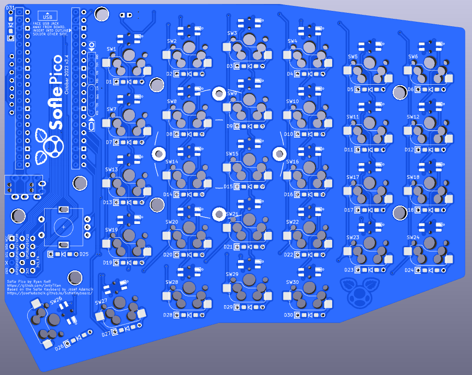

# Sofle Pico Keyboard
Sofle is 6×4+5 keys column-staggered split keyboard with encoder support, per-key RGB, dual 128x64 OLEDs, and uses the RP2040 based Pi Pico MCU. 

The Sofle Pico was designed by [Ryan Neff](https://github.com/JellyTitan), based on the excellent Sofle Choc designed by [Brian Low](https://github.com/brianlow), that is based on the fantastic Sofle RGB by [Dane Evans](https://github.com/DaneEvans) which was based on the original Sofle v2 by [Josef Adamčík](https://github.com/josefadamcik). The MX footprints came from the well-regarded foostan [kbd library](https://github.com/foostan/kbd). Thank you to the [Junco](https://github.com/Daneski13/Junco#optional---rgb) for providing a viable Pico LED level shifting circuit.

## Punchlist before Sofle PR
* @todo Added handedness by pull an unused pin high/low (Example here: https://github.com/TweetyDaBird/Lotus-Keyboard)
* Revert LED cutouts from drills to edge cuts.
* @todo Base on the stront build guide - we may be able to omit the level shifter completely? (Test with thermal imager?)
* @todo refresh Gerbers and update path 
* @todo: Update build guide flashing to include pico 'drag and drop' flashing
* Add UF2 files and update relative path in README.
* Update header pin length in readme.
* Add optional header pin images in readme.
* Ubberice tweaked thumb trace - look closer

## Punchlist before QMK PR
* @todo Added handedness by pull an unused pin high/low
* Add "boot mode" graphic: https://docs.qmk.fm/#/feature_oled_driver?id=other-examples
* @todo adapt bongocat for 128x64 (doio/kb16 has a 128x32 library that can be adapted.)
* @todo The Pimaroni works - but it kinda sucks. Is that expected behavior, or can it be cleaned up with some 'debounce' in the firmware?
* @todo: via support. (Update docs too!)

[Overview](#overview)
 - [Pi Pico vs. ProMicro](#pi-pico-vs-promicro)
 - [Features inherited from V2](#features-inherited-from-v2)
 - [New features](#new-features-in-the-sofle-pico)
 - [Notable changes](#notable-changes)

[Bill of Materials](#bill-of-materials)
 - [Required Parts](#required-parts)
 - [Optional - RGB](#optional---rgb)
 - [Optional - OLED](#optional---oled)
 - [Optional - MCU Sockets](#optional---mcu-sockets)
 - [Optional - Solenoid](#optional---solenoid)
 - [Optional - Pimaroni trackball](#optional---pimoroni-trackball)
 - [Optional - key plates](#optional---key-plates)
 - [Optional - low profile header pins](#optional---low-profile-header-pins)
 - [Tools and materials](#tools-and-materials)

[Build Guide / Assembly steps](#build-guide--assembly-steps)
 - [Prepare](#prepare)
 - [Soldering](#soldering)
 - [Diodes](#diodes)
 - [Switch Sockets](#switch-sockets)
 - [Level Shifter](#level-shifter)
 - [LEDs](#leds)
 - [Pi Pico MCU](#pi-pico-mcu)
 - [OLED](#oled)
 - [TRRS Jacks](#trrs-jacks)
 - [Rotary Encoders](#rotary-encoders)
 - [Hot-swap Sockets](#hot-swap-sockets)
 - [Final assembly](#final-assembly)
 - [Warnings and disclaimers](#warnings-and-disclaimers)
 - [Firmware and programming](#firmware-and-programming)

[Troubleshooting](#troubleshooting)
 - [No LEDs are working](#no-leds-are-working)
 - [Some LEDs are not working](#some-leds-are-not-working)
 - [An entire row or column of keys is not working](#an-entire-row-or-column-of-keys-is-not-working)
 - [Random key or keys not working](#random-key-or-keys-not-working)

## Overview

### Pi Pico vs. ProMicro
Whereas [Sofle v1 & v2](https://github.com/josefadamcik/SofleKeyboard) used the Promicro MCU, Sofle Pico is built specifically for the RP2040 Pico MCU. The Pico offers larger memory options at a low price point. [Inexpensive clones are readily available](https://www.aliexpress.us/w/wholesale-raspberry-pi-pico.html). The increased MCU capacity of the Pico allows for more features like screen animations and RGB animation effects.

Although there is a QMK option to port the legacy pro-micro config to rp2040 boards that are backwards compatible, the rp2040 pins are not 5v tolerant. Essentially, the per key rgb doesn't work as it should.

There are many rp2040 boards available in the same form factor as the Promicro, but they tend to be 4-8 times more costly than the Pi Pico form factor, and inexpensive [Pi Pico clones](https://docs.google.com/spreadsheets/d/1LPjy6F5lHfUkmsrM5zlZmc5auYy5YBakW8Awe6hYFWo/edit#gid=0) are [readily available](https://www.aliexpress.us/item/3256803909832318.html).

Accommodating the voltage variances between the ProMicro and the Pi Pico required drastic wiring changes which results in the loss of backward compatibility with Sofle v1/v2 firmware. The SK6812MINI-E LEDs commonly used with ProMicro keyboards require 5v logic. The Pi Pico uses 3.3v logic. A level shifter, along with a lower current LED variant, specifically the SK6803MINI-E, work with the lower voltage. Thank you to Dane Skalski and the [Junco](https://github.com/Daneski13/Junco#optional---rgb) for providing this excellent 3V logic circuit.

### Features inherited from V2
 - Key placement has not changed. (mostly - 1 thumb key got a 3 degree rotation).
 - Hotswap sockets are required. 
 - Per-key RGB remains optional and uses the _relatively_ easy to solder SK6803 MINI-E LEDs. (Note lower current variant required for Pico).

### New features in the Sofle Pico
* Default OLED is now 64x128, as opposed to 32x128.
* OLED ports are separated and offset, so no jumper soldering is required.
* 2 Common SSD1306 64x128 OLED variants are supported. The two common variants are circle corner and oval corner, which have different pinouts. There may be more pinout variants out there!
* Added easily accessible [Pimoroni trackball](https://shop.pimoroni.com/en-us/products/trackball-breakout) tie in footprint. It works, but it's still a Pimoroni - so IMO it's still not a great experience. Your mileage may vary. 
* Simplified the PCB & improved labeling to help with build troubleshooting. (The addition of a GND & VCC planes specifically).
* Added through-hole/Surface mount hybrid footprints for the per-switch diodes.
* Added a 'breakout' section for the unused pico pins to allow for easy tinkering.
* The default communication protocol is full duplex TX/RX.
* Designed for automated PCB Assembly.

### Notable changes
* Improved labeling and footprint masking to poke-yoke the build process.
* 3 degree rotation of the innermost thumb key. 
* Sofle V1 & V2 firmware is not compatible due to the complete rewire for pi pico.
* Added drill holes above the mini-e hole to allow for easier tweezer placement.
* MCU footprints side-by-side to reduce potential shorts.
* Removed legacy I2C Bus implementation.
* Modified thumb cluster outline to accommodate 1.25u thumb keycap.
* Added teardrops to decrease likelihood of acid traps during manufacture.
* Added VCC & GND net to simplify routing.
* Poka-yoke TRRS footprint by removing unnecessary solder masks.
* Diode placement & labeling improved for easier troubleshooting.
* Diodes can be installed on the front or back, making for lower cost PCBA.
* Diodes can be SMD or through-hole. Through hole being easier to hand solder, and SMD are prefered for PCBA.
* Reset button removed. It is no longer needed, as the Pico has a physical rest button.
* The MCU is now facing upward. There are many PiPico board variants with buttons placed differently. Facing the MCU upward ensures accessability.

* Tenting puck mounting holes added. [SplitKB](https://splitkb.com/products/tenting-puck) or 3d print your own: design by [
Bubbleology](https://www.printables.com/model/235433-tenting-puck-for-keyboard-tripod-mount/comments/943096).

## Bill of materials

### Required Parts

| Name | Count | Remarks | Potential Storefront |
| ------------------------------------ | ----------------------- | ----------------------------------------------------------------------------------------------------------------------------------------------------------------------------------------------------------------------------------------------------------------------------------------------------------------------------------------------------------------------------------------------------------------------------------------------------------- | --------------------------------------------------------------------------- |
| PCB | 2 | The PCB should be 1.6mm thick. I used JLCPCB's default settings only customizing the PCB color, and selecting 'lead free'. | Manufacturers such as JLCPCB, LCSC, and Elecrow. [Price comparison tool](https://pcbshopper.com/) | |
| MX Hot-swap Sockets | 58 | The PCB requires sockets. Switches cannot be soldered directly to the board. | [Aliexpress](https://www.aliexpress.us/item/3256803687338432.html) |
| Diodes | 62 | Surface mount SOD-123 1N4148, or through-hole 1N4148 diode. These are common, any old one should do. Through hole is usually easier to solder. | SMD: [AliExpress](https://www.aliexpress.us/item/2251832663565152.html) [JLCPCB](https://jlcpcb.com/partdetail/3368026-1N4148SOD123/C2972760) Through-hole: [AliExpress](https://www.aliexpress.us/item/2251832473773777.html) |
| Raspberry Pi Picos | 2 | PCB is specifically designed with the official Pico and YD-2040 type clone in mind, however several [other clone types](https://docs.google.com/spreadsheets/d/1LPjy6F5lHfUkmsrM5zlZmc5auYy5YBakW8Awe6hYFWo) should be compatible (Waveshare, WeAct, EstarDyn, Tenstar). Although the Pico is designed with a surface mount option, the Sofle Pico is designed assuming the Pico is soldered with [headers](https://www.sparkfun.com/products/17907).| [AliExpress, YD-2040](https://www.aliexpress.us/item/3256803909832318.html) |
| TRRS Jacks | 2 | PJ-320A | [AliExpress](https://www.aliexpress.us/item/2255800474897706.html) |
| TRRS  (3.5mm "Headphone" Cable) | 1 | TRRS ("4 pole" required) | |
| MX Style Switches | 58 | 3-pin or 5-pin will work. If you're not using a keyplate, you'll want 5-pin.| |
| Key Caps | 58 | | |
| Rotary Encoders and Caps | 2 | EC-11 Rotary Encoder. 20mm stem is the most common. Make sure the knob matches the encoder's shaft diameter, depth and shape. SA keycaps can be quite tall, so you may want to use tall knobs as well.| [AliExpress 20mm](https://www.aliexpress.us/item/2261799870168498.html) |
| M2 8mm FF spacers | 12 | Connects the bottom plate to the key plate, running through the PCB | |
| M2 12mm FF spacers | 6 | Connects the bottom plate to the OLED plate, running through the PCB and the keyplate. @todo - is it really 12mm? | |
| M2x4mm screws | 18 | M2 screws. | |
| Case | 1 Left Set, 1 Right Set | Case files are located in the [case folder](./Case). | @todo - regenerate after v3.3 prototype validated |
| Micro USB Cable or USB-C Cable | 1 | USB cable for connecting the keyboard to your computer, dependent on what the Pico you chose uses. | | 

### Optional Parts - RGB

These parts are necessary for the RGB lighting.

| Name | Count | Remarks | Potential Storefront |
| --------------------------------------------- | ----- | ---------------------------------------------------------------------------------------------------------------------------------------------------------------------------------- | ------------------------------------------------------------------ |
| 74AHCT1G125 Voltage Level Shifter/ Bus Buffer | 2 | SOT23-5 Footprint     Required for LEDs to work properly, Pico runs at 3.3V while the LEDs will require 5V | [AliExpress](https://www.aliexpress.us/item/3256803831434811.html) [JLCPCB](https://jlcpcb.com/partdetail/TexasInstruments-SN74AHCT1G125DBVR/C7484)|
| RGB SMD LEDs SK6803MINI-E | 74 | The 3MA SK6803MINI-E must be used instead of the more traditional 12MA SK6812MINI-E. The SK6803MINIE-E has a smaller current draw, allowing the LEDs to be very bright at manageable wattage. | [AliExpress](https://www.aliexpress.us/item/3256803450292556.html) [JLCPCB](https://jlcpcb.com/partdetail/Normand-SK6803MINIE/C5184589)|

### Optional Parts - OLED
| Name | Count | Remarks | Potential Storefront |
| - | - |-|-|
| SSD1306	128x64 | 2 | These are monochromatic, usually white, yellow, or blue.     Note: There are two common variants of this OLED. One has circular holes in the corner, and the other has oval holes.   These variants have the GND/VCC pins switched. The version with the round holes is preferred, but either will work. (The round holes is installed 10mm higher, so it is preferred based solely on aesthetics.) If you come across more variants or different pin positions, please submit a PR!  | [AliExpress](https://www.aliexpress.us/item/2251832457635357.html)|
| 4 pin female headers | 2 | 2.54 pitch. ~8mm high is preferable if you'll be socketing the MCU. If you can't find 8mm, ~6mm or ~10mm is fine. |[Aliexpress](https://www.aliexpress.us/item/2251832667924622.html)|

### Optional - MCU Sockets
This is strictly a quality of life upgrade. The older ProMicro's were notorious for weak Micro USB jacks that could snap off. This is not needed with the Pi Pico which uses USB-C. However - if your using socketed OLEDs, the OLED sockets put the OLEDs about 5mm (@todo - measure this) above the board, so socketing the MCU helps support the OLEDs.
| Name | Count | Remarks | Potential Storefront |
| - | - |-|-|
2.54mm Round Female Pin Header | 4 sets of 20 | They commonly come in strips of 40. They don't always snap in half cleanly, so get extra | [Aliexpress](https://www.aliexpress.us/item/2251832729504304.html)
Needle pin male connectors | 80 | Diode legs would also work, but these little sets of 4 are nice to work with. | [Aliexpress](https://www.aliexpress.us/item/2251832650595759.html?spm=a2g0o.order_list.order_list_main.186.15a91802YueygY&gatewayAdapt=glo2usa)

### Optional - Solenoid
The solenoid feature is still a work in progress. It is designed to attach to a separate backplate.
Based on this [diagram by Adafruit](https://cdn-shop.adafruit.com/product-files/412/solenoid_driver.pdf). 
[QMK Docs for solenoid.](https://docs.qmk.fm/#/feature_haptic_feedback?id=solenoids) This needs to be re-worked to account for the lower voltage and draw of the Pico. (I tried the existing circuit with a 1k resistor - Pico was not strong enough).
| Name | Count | Remarks | Potential Storefront |
| - | - |-|-|
| Solenoid | 1 | 4.5v Solenoid - I've only been able to get the Amazon Uxcell solenoid to work. I suspect the voltage is a bit low. | [Amazon](https://www.amazon.com/dp/B013DR655A/ref=cm_sw_em_r_mt_dp_YHJRTZ5YY042HC7522VG?_encoding=UTF8&psc=1)
 ~~2.2k Resistor~~ | 1 | ~~The 2.2k resistor works with the 5v ProMicro.~~ @todo do the math here.| |
 1N4001 Diode or MUR340 | 1 | Either the through hole IN4001 or the Surface mount MUR340 will work. | [AliExpress](https://www.aliexpress.us/item/3256802685977811.html)|
 TIP 120 | 1 | @todo Do the math here - is this still the best part? | 

### Optional - Pimoroni trackball
Electrically, this should work - but i have not validated it. 
| Name | Count | Remarks | Potential Storefront |
|-|-|-|-|
| Pimoroni trackball | 1 | The default footprint replaces a rotary encoder. Installing flush to the board is a bit too low to be comfortable, so you may want to raise it. @todo elaborate.|[Pimoroni](https://shop.pimoroni.com/en-us/products/trackball-breakout)|

### Optional - key plates:
 - The top/key plates from Sofle v1, v2, RGB and Choc versions are not compatible.
 - Key plates are strongly recommended, but not technically required. (If you use 3 pin MX keys, the thumb keys tend to fall out if you don't use a key plate).
 - The key plates combined with a backplate make a nice 'sandwich' case. Another plate can be added to protect the OLEDs. 
 - Spacers are intended to pass through the main pcb and screw onto the bottom plates, top plates, and OLED plates.
 - The OLEDs are taller than the switch plate, which is why they have their own separate taller plates. Acrylic is recommended for the OLED plates because the two types of OLEDs can be installed higher/lower.
 - Plates can be made from acrylic or pcb.
 - Having a standoff kit is helpful when assembling the keyplates. [M2 Brass Standoff Kit](https://www.amazon.com/gp/product/B07B9X1KY6)
 - Acrylic key plates should be 3mm thick, and PCBs should be 1.6mm thick. The switches fit better in the PCBs because most switches have 'retention nubs' designed for PCBs. 

 | Name | Count | Remarks | Potential Storefront |
|-|-|-|-|
| keyplates | 2 | |Elecrow is great for acrylic, JLC is good for PCB|
| backplates | 2 | |Elecrow is great for acrylic, JLC is good for PCB|
| OLED plates | 2 | If using PCB, note there are variants for the different types of OLED's that have higher/lower holes. |Elecrow is great for acrylic, JLC is good for PCB|
|M2 6mm screws|16| Any old M2 will do. I prefer hex cap for aesthetics.|[Amazon](https://www.amazon.com/gp/product/B07ZH6GRK2)|
| M2 18mm female-female standoffs (Same height for Acrylic or PCB)| 6 | Connects the OLED plate to the back plate, runs _through_ the pcb and the key plate.|[M2 Brass Standoff Kit](https://www.amazon.com/gp/product/B07B9X1KY6)|
| M2 6mm female-female standoffs (6mm for acrylic, 8mm for PCB)| 10 | Connects the front plate to the back plate, runs _through_ the pcb.|[M2 Brass Standoff Kit](https://www.amazon.com/gp/product/B07B9X1KY6)|

### Optional - low profile header pins
- The header pins that come with the Pico are usually too long. You can either clip them off after soldering, or use [low profile header pins](https://www.aliexpress.us/item/3256805874707460.html) instead. 

@todo Update header pin length - 7.5mm or 8.55mm?

## Tools and materials

- soldering iron and solder
- no-clean flux makes soldering easier
- solder wick or desoldering pump to correct mistakes
- good tweezers
- flush cutters to trim diode legs
- masking, kapton or electrical tape
- isopropyl-alcohol for cleaning
- multimeter for troubleshooting

## Build Guide / Assembly steps
This guide includes all optional components.
### Prepare

Make sure you know which side you are working on, and don't make two left hand sides by mistake. Stick a piece of tape on the front side of both PCBs to help remember.

This guide is written in the order I like to install components, starting with the components on the back, shortest to tallest:
 - diodes
 - LEDs
 - level shifter
 - switch sockets

Then install the components on the front:
 - Pico MCU & socket
 - OLED & socket
 - TRRS connector
 - Rotary encoder

The order of assembly does not matter **except** for these 2 components because they stack on top of one another:
1. the Pico MCU
1. the OLED screen

### Poka yoke
When designing the Sofle Pico, an effort was made to '[poka-yoke](https://en.wikipedia.org/wiki/Poka-yoke)' the design, that is, to make the design as 'fool proof' as possible to assemble. 

Specifically, clear markings/symbols and selective masking of footprint through-holes are used to ensure that components are soldered to the correct side & in the correct orientation. Outlines indicate the side the component should be inserted into. The side with the outlines has footprint through-holes masked, so that if the user inserted the component from the wrong side, it would not be solderabe.

Please open an issue if you have a suggestion for improving the poka-yoke. (I'd like to move away from English language notes, and replace them with universal pictograms if the time ever

### Diodes

Diodes, surface mount or through-hole, can be installed on either the front or the back. The back is preferred for a cleaner look. If you are hand soldering, through hole diodes are recommended because they are easier. If you damage a pad on one side, feel free to move that diode to the other side.

Diodes _must_ be oriented with the white band in the direction of the "arrow" symbol on the PCB.

For surface mount diodes, a common method is to tin one pad, place the diode on, apply the soldering iron to the diode leg until it melts the solder underneath and sinks flush with the PCB. Then come back and solder the other leg. Alternately, you can use a rework station heat gun and solder paste. (I prefer this method for smds).
.

There is 1 diode per key, 1 diode on the rotary encoder, and one for the Pico on the far right.

### Switch Sockets
Switch sockets installed on the back of the PCB facing up towards the front of the PCB. Make sure they are flush with the PCB. 

Heat the metal connector, apply solder and look for the solder to wick down to the PCB. You want a solid joint since this may take some mechanical strain from switch installation and removal.

### Level shifter
The level shifter is tiny & squirrley. It's the same size as an SMD, but with 5 pins. There is only one footprint for this component - so it will be on the front on the left hand, and on the back on the right hand. Tack one corner down, and then "[drag soldering](https://www.youtube.com/watch?v=wUyetZ5RtPs)" the remaining pins. 

### LEDs

LEDs are placed on the back of the PCB. The lens should point up through the PCB so they shine into the bottom of the switch. One leg will have a diagonal cut. This cut leg should be aligned with the mark on the PCB.

To solder: tin one pad, place the LED and hold using tweezers, apply heat to the leg until the solder melts and the LED is flush with the board. Now the remaining legs can be soldered without the component moving. The LEDs are sensitive to heat. Let the LED cool between soldering each leg. Use the lowest heat needed for your solder.

Alternately, you can use a rework station heat gun and solder paste. I prefer this method for the LEDs, i think it's easier to get components to sit flush. Put a dab of solder paste on each pad, then place your LEDs with tweezers or a steady hand. (The holes above/below the LED hole are intended to make tweezer placement easier).

The LEDs are wired in one long chain. If a LED is not working, replace the LED and the LED preceding it. Sometimes just the output of a LED is damaged. The full chain does not need to be installed if you want to test a partially built board.

### Pi Pico MCU

The Pico is installed on the top of the board, face up, and in the marked holes. (There are many variants of the Pi Pico - the face up orientation ensures easy access to the reset button wherever it may be).

* Top of the board: this is the side of the PCB opposite the diodes, LEDs and switch sockets
* Marked holes: Insert the Pico into the holes with the rectangular outline on the top of the board. 

Double-check your work here. This step is hard to reverse if a mistake is made.
#### Pi Pico MCU installed permanently with header pins
You can permanently install the Pico using the 20-pin male-male headers that came with the Pico. 
1. insert the headers into the board and the Pico both before soldering. (The header pin rows can tilt a little if it's not inserted into both the board and the Pico.) The header pins may have one longer side. Install the longer side on the PCB, because you'll need to trim these, and the trimmed pins look better on the underside of the board. Use a piece of kapton tape to attach the Pico to the PCB while soldering.

1. Flip the board over. The pins on the back of the board that you will be soldering should _not_ be in the outline. Soldering 1 of the outermost pins on each pin header on the PCB. Hold the board up to make sure the pin header is sitting flush with the pcb. If it's not, you can reheat that joint until it is flush. 
*@todo - this pick is gross - grab another without smudges and cathair.*
 
1. Solder the remaining pcb/pin header joints on the back.
1. Flip the board over. With the Pico, repeat the process of soldering & checking 1 pin with the pin header and the Pico. 
1. Solder all the remaining Pico/pin header pins.
#### Pi Pico MCU installed with sockets
Previous versions of the Sofle used diode legs. This guide does not - instead we'll use "needle pins", which are now readily available, inexpensive, and less fussy then diode legs. The needle pins will add some height to your MCU, which works well to support the OLEDs.

You can use diode legs if you're feeling fancy.
To install a socketed Pico using the diode leg approach [from splitkb.com][promicrosocketing]:

1. Insert the needle pins into the female sockets, and then insert the female sockets into the PCB and the Pico. Assembling the sockets/Pico/PCB before soldering ensures an excellent alignment. Be sure that the Pico is face up, and that the socket pins are inserted into the square outline on the front of the board. Applying a piece of kapton tape to hold everything in place can be helpful. 

1. Flip the board over. On the back of the PCB, solder one pin on each side, pushing down on the PCB to ensure the headers are perpendicular and fully seated. Pick up the board and inspect to insure that everything is seated flush. If it's not flush, reheat the joint and push the socket down until it's flush. (Be sure you're not touching the pin your heating when you push it down).

1. Solder the remaining pins on the back of the pcb.

1. Flip over the board. On the front, solder 1 pin on each side to the Pico. Again check that everything is flush before soldering the remaining pins.

If you ever need to remove the Pico: do it by gently prying the board up in small increments, working your way around the board. Avoid pressure on the USB connector. The diode legs are quite weak and will usually bend if you pull the Pro Micro off in one action.

### OLED
@todo add updated images when v3.4 prototype comes in.

There are two common variants of the SSD1306 OLED. They are easily distinguishable by the corner holes. There is a separate socket for each of these, because they switch the GND/VCC pins. This pins are usually labeled on the OLEDs themselves. 

**Please check the OLED pin labels against the marking on the PCB to ensure everything matches.** It's entirely possible that the OLEDS have GND/VCC in different locations than expected. (If you do find some that differ from the oval/round below, please update this doc ans submit a PR)! The GND pin is square.

  

We will be installing the OLED so it overhangs the Pro Micro. 
1. Determine which socket your model of OLED will use.
1. Add a strip of electrician's tape to the bottom of the OLED module where it might contact the Pico.
1. Insert the 4 pin, half height female header into the appropriate outlined footprint on the top of the PCB. On both the right and left hands, this will be to the right of the Pico. Use kapton tape to hold the socket in place while you solder the first pin. Check that the socket is perpendicular to the pcb. If it's not, reheat that solder joint and adjust.
1. Solder the remaining socket pins.
1. Push the OLED pins into the socket. You may need to trim the OLED pins so the insulation on the female and male headers mate and the OLED sits just above the Pro Micro. The downside to socketing is the OLED isn't as secure in the half height socket. When turning the keyboard upside down I find the OLED will lever away from the Pro Micro somewhat.
1. If you chose to solder the Pico without sockets, there may be a gap between the OLED and the Pico. You can add an [adhesive bumper pad](https://www.amazon.com/gp/product/B074C2XKXH/?th=1) to ensure it rests level. A rolled up piece of electrical tape will also work.

### TRRS Jacks
Solder these on the front of the boards, inserting into the outline.
Some brands of jack will snap into the board, holding them in place while you solder. Other brands may require tape. Solder 1 pin first to check that everything is flush. Adjust as needed. Solder remaining pins. 

### Rotary encoders
Saved these for last because they are tallest. Insert into the top of the board, and solder on the backside. Some EC11's have metal tabs on opposite sides that add mechanical stability - no need to solder those.

### Final assembly
Installing the keys and case.

1. Snap a few switches into the top plate, the corner switches work best.
1. Place the PCB on a flat surface. This will save some strain on the solder joints in the next step (though they should be able handle it).
1. Carefully lower the top plate with switches on the main PCB and push into sockets. Ensure pins are aligned.
1. Snap the remaining switches into the top plate pressing into the sockets.
1. Place the encoder knob on the shaft. Tighten the set screw with a hex key. A small screwdriver for glasses may do in a pinch.
1. Slide the four 8mm standoffs through the PCB and align to the holes on the key plate. Attach the standoffs to the keyplate using M2 screws. 
1. Attach the bottom plate to the four standoffs installed in the previous step.
1. Use M2 screws to attach the three 12mm standoffs to the OLED cover plate.
1. Slide the three standoff on the OLED plate through the PCB. Attach those standoffs to the backplate using M2 screws.
1. Put at least 4 adhesive rubber feet in the corners so the keyboard is not moving when you type.

## Warnings and disclaimers
- Don't connect or disconnect the TRRS cable when the keyboard is powered. It may short out. Always disconnect the USB cable first.
- Be gentle with USB-C ports on your microcontrollers. They are easy to break.
- Keep in mind that this is a prototype of a DIY keyboard. It’s not a polished product.

## Firmware and programming
@todo - update hte firmware.
### The easy way
The rp2040 supports 'drag and drop' flashing with a UF2 file on Mac or PC. This is the recommended approach if you're not familiar with compiling QMK firmware yourself. After the first 'drag and drop' flash, you can tweak your keymaps further using [VIA](https://www.caniusevia.com/).

VIA allows you to quickly change your keymap without flashing or a QMK build environment. I highly recommend it for experimenting. There are few downsides:
- it doesn't support custom logic like a key for switching between Mac/Win
- the exporting/importing keymaps has some problems with some multi-chord keys though typically I don't find I need to export/import
- lighting configuration keys only seem to affect lighting on the master side. If you don't change lighting much, a workaround is to plug just the right side in to the computer, change the lighting then plug everything back normally

To flash with 'drag 'n drop':
These instructions are a summarization of the [official explanation found in the QMK docs](https://docs.qmk.fm/#/flashing?id=raspberry-pi-rp2040-uf2).
1. Make sure halves are not connected together with TRRS cable.
1. Connect one half to USB.
1. Enter the bootloader using any of the following methods. These are dependant on where your RP2040 came from. You may have to remove an OLED to access the `BOOT` button.
    * Hold down `BOOT` and tap `RESET`.
    * Hold the `BOOT` button while pluging in the usb cable.
    * Double tapping the `RESET` button on the RP2040. ([Double tap reset is enabled by default on the RP2040](https://github.com/qmk/qmk_firmware/blob/master/docs/platformdev_rp2040.md#double-tap-reset-boot-loader-entry-iddouble-tap)).
    * **Bootmagic reset** (works after you have flashed once): Hold down the top far corner key while plugging in the keyboard (`~` left half, `-` right half). This will also clear the EEPROM.
1. Wait for the OS to detect the device.
1. Copy the .uf2 file to the new USB disk. 
  * The files can be found in this repo at ./Sofle_Pico/Firmware
  * There is a different file for right hand and left hand, as denoted by a `_RH` or `_LH` suffix. (@todo - can we use matrix detection to use a single file for both hands)?
  * On Mac after the file is dropped, the 'Keyboard setup assistant' may be triggered. You can ignore and quit the assistant.(@todo add relative path to UF2 files.) 
1. Unplug the side you just flashed, and repeat the process with the other side.
1. Disconnect both halves from USB.
1. Connect both halves together using the TRRS cable. 
1. Connect the left half to USB.
1. Test everything using VIA. (After you've downloaded and installed the VIA app from https://caniusevia.com/, it should recognize the keyboard when it opens).

### The less easy way
If you want to build your own firmware, Sofle Pico uses [QMK Firmware][qmk_firmware]. Support is not in the main QMK repository [yet](@todo: Update this url with official PR). Instead use the [jellytitan/qmk_firmware](https://github.com/jellytitan/qmk_firmware) fork.
https://docs.qmk.fm/#/flashing?id=raspberry-pi-rp2040-uf2

To flash:
- Clone [https://github.com/jellytitan/qmk_firmware](https://github.com/jellytitan/qmk_firmware)
- Switch to the `sofle_pico` branch with `git checkout sofle_pico`
- Make sure your QMK environment [is setup][qmkintro].
- Make sure halves are not connected together with TRRS cable.
- Connect one half to USB, flash the firmware (always follow the current instructions in the QMK documentation! The command might look something like this: `qmk flash -kb sofle_choc -km default`). Use the reset button to reset the keyboard when you are asked to in console. 
- Connect the second half and flash it in the same way as the previous one.
- Disconnect the USB cable. Connect both halves together with TRRS cable.
- Connect USB cable to the **left** side.
- Enjoy!

 

## Troubleshooting

See the Sofle build guide.

## Links

- [Github with KiCad projects][soflegithub]
- [Layout in KeyboardLayout editor][soflechoclayout]
- [QMK Firmware][qmk_firmware]
- [QMK Configurator][qmk_configurator]

## Default layout

The default layout for the Sofle Choc is in the QMK fork and demonstrates some LED functions.
@todo: validate this image works as expected after folding into the main repo.

## Images of keyboard
@todo update these after final hardware!!

## Version History
@todo: Would it be appropriate to move the build_log here?
* v2.1.1 - Top plate: moved the version label to less visible location, widened the area above the encoder. PCB version remains at v2.1
* v2.1 - First published version

<mark>[🔼 Back to top](#sofle-pico-keyboard)</mark>
## Footnotes
[layoutarticle]: <https://josef-adamcik.cz/electronics/in-search-of-the-best-custom-keyboard-layout.html> "In search of the best custom keyboard layout"
[introductionarticle]: <https://josef-adamcik.cz/electronics/let-me-introduce-you-sofle-keyboard-split-keyboard-based-on-lily58.html> "Let me introduce you SofleKeyboard - a split keyboard based on Lily58 and Crkbd"
[soflelayout]: http://www.keyboard-layout-editor.com/#/gists/76efb423a46cbbea75465cb468eef7ff "Sofle Keyboard layout at keyboard-layout-editor.com"
[soflechoclayout]: http://www.keyboard-layout-editor.com/#/gists/5604075ad16c10a8c634828c5911d2b6 "Sofle Choc Keyboard layout at keyboard-layout-editor.com"
[soflegerber]: https://github.com/josefadamcik/SofleKeyboard/releases "SofleKeyboard - gerber files"
[qmk_firmware]: https://github.com/qmk/qmk_firmware/ "QMK firmware"

[qmk_configurator]: https://config.qmk.fm/#/sofle/rev1/LAYOUT "QMK configurator"
[springpinheader]: <https://yushakobo.jp/shop/a01mc-00/> "Spring pin headers - Japanese"
[qmkprotonc]: https://qmk.fm/proton-c/ "QMK Proton-C"
[promicrosocketing]: <https://docs.splitkb.com/hc/en-us/articles/360011263059> "How do I socket a microcontroller? by splitkb.com"
[qmkintro]: <https://docs.qmk.fm/#/newbs_getting_started> "QMK getting started"
[qmkhandedness]: <https://docs.qmk.fm/#/feature_split_keyboard?id=setting-handedness> "QMK firmware - setting handedness"
[soflegithub]: https://github.com/josefadamcik/SofleKeyboard "SofleKeyboard - KiCad project on Github.com"
[sourcing]: <{{ site.baseurl }}/sourcing_parts.html> "Sourcing parts"

v3.5: Board routing revision made by [uberrice](https://github.com/uberrice)