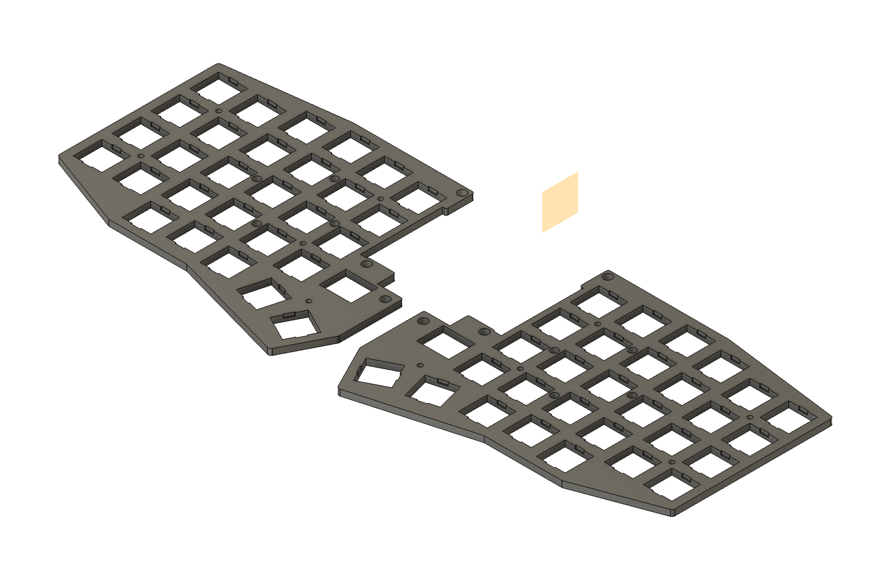
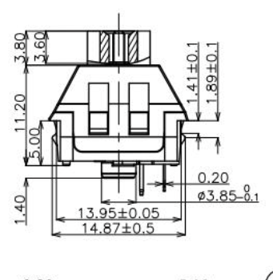

# About the 3d printable plates

The slicer ready files can be found in the "production_ready" folder. These are 3mm thick.

The latest version of the key plates have notches that the switches slot into. The non-notched earlier version of the key plate have been removed from the repo. The notched key plate should be printed with the pretty side toward the print bed, so there is a right hand & left hand versions of the file.

 

There are two variants for the OLED covers due to the two types of OLEDs that can be used. 

If you make a set, can you submit a PR with some pictures?

## About these plates
These plates were created by exporting svg layers directly from KiCad. The Svg's were imported into Fusion360 with a 3.7795% scale. (Not sure why the KiCad exports are so small - but that multiplier seems to get them where they need to go). The svg sketches were fixed up, then extruded to 3mm.

The fusion 360 export is included in the 'source' folder. Feel free to get fancy with it!