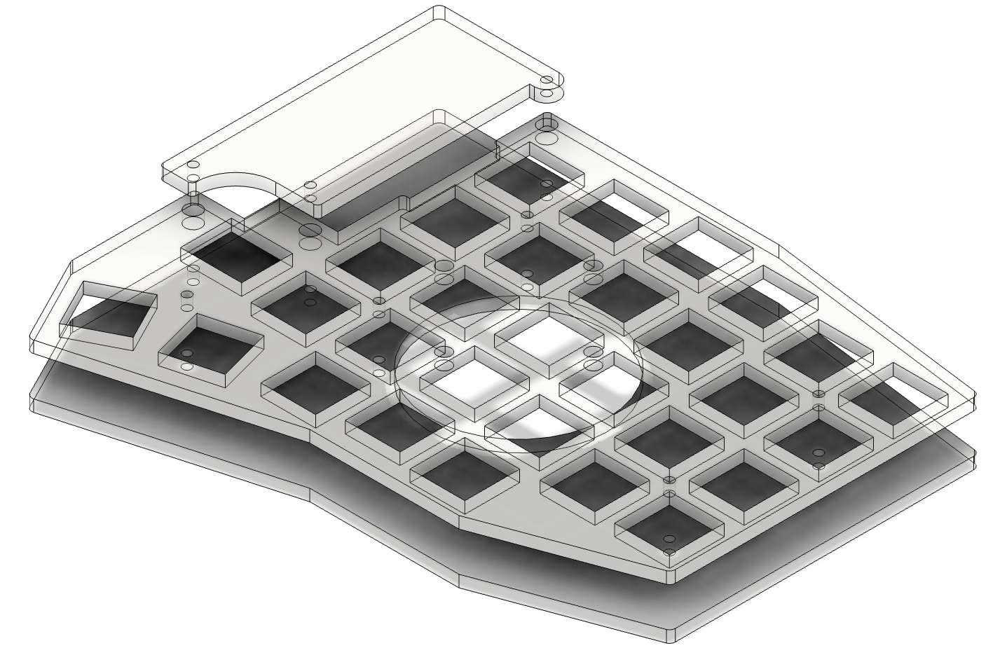

# About the acrylic case
This case was created by exporting svg layers directly from KiCad. The Svg's were imported into Fusion360 with a 3.7795% scale. (Not sure why the KiCad exports are so small - but that multiplier seems to get them where they need to go). From Fusion360, the outlines are exported as a .dxf. The .dxf's have been zipped because the only vendor I've tested these with is Elecrow. 

The productin ready files for upload can be found in the "production_ready" folder. I recommend 3mm thickness.

If you make a set, can you submit a PR with some pictures?

