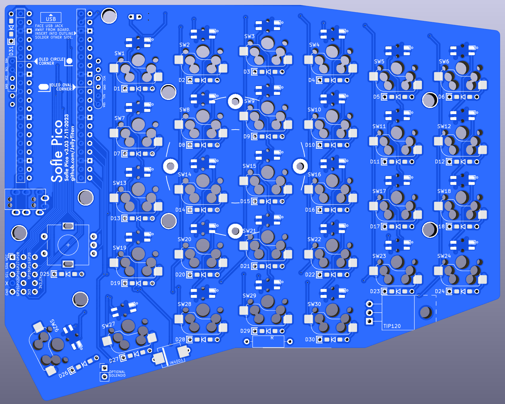
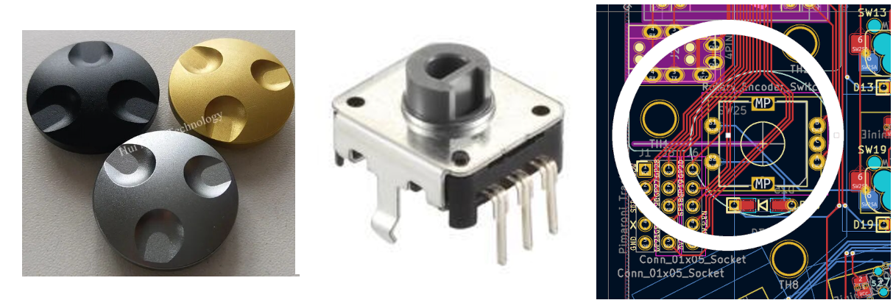
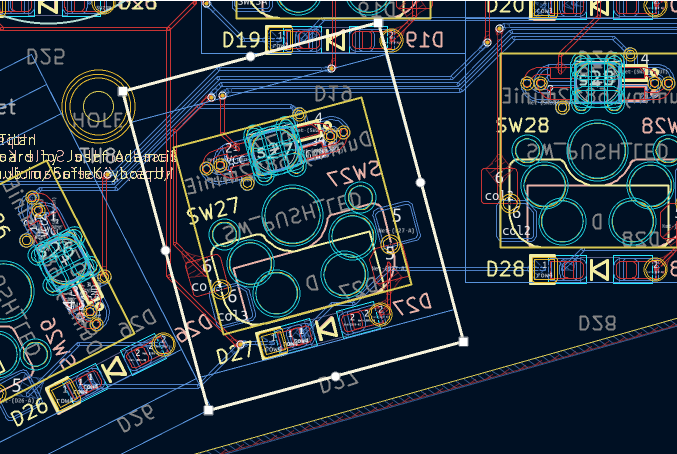
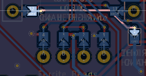
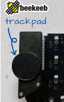
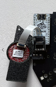
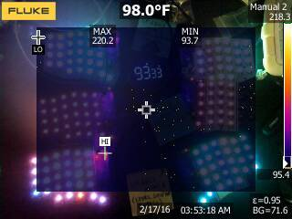

# Sofle Pico Build log
These notes were made in KiCad during the design & build process. There were ultimately 4 produced iterations to get things dialed in. Mostly a personal punch list.

## First Draft, V3.1

* NOT RELEVENT: (REPLACE WITH DIFFERNT OLED) Increased annular ring size for 32x128 stacked oled. (This footprint will be replaced by a 64x128)
* DONE: Swap in the correct oled
* DONE: Removed pico pads & rebuilt teardrops
* WONT DO: Update communication from serial to TX/RX. Maybe add the optional I2C back in, with better jumpers nad markings? (ARM spli boards do not support I2C. Half duplex/Serial comm is recommended. Left a pin open to expand to TX/RX in the future)
* DONE: (Mostly) TRRS/TRS jack is all loosey goosey. Go back to TRRS jack that is asymetrical for stability.
* WONT DO: Move components out from under the Pico so it can be drag soldered (The off-brand Picos don't support this, plus we want the picos all facing down)
* DONE: Modify pico holes to account for off-brand Picos. 
* DONE: What to do about pico led? Maybe split out to double footprint again? (Added double footrpint so the LED always faces down)
* DONE: The RH Oled is under the pico. Respect the board outlines (Moving to new OLED style fixes this)
* DONE: Add puck footprint
* DONE: Add level shifter bypass
* DONE: After moving Oled and trrs, add 3rd hole for OLED plexi screen protector
* DONE: Does the vsys diode have an orientation?(Validated orientation matches the Junco)
* DONE: The hotswop sockets and LEDs are in a single combo footprint. This is great for design, but a PITA for automated production. Need to create a placebo to generate proper PNP/BOM files. (Used a "dummy" footprint). The sk6812mini-e's require 'standard' assembly, which is a large upcharge. 

## V3.1 -> 3.2
* Notes to self: The Pico variants are pretty fat. The pico outline is flush with the double sided OLED footprint. The double sided oled footprint sides can be seperated a bit if need be.
* DONE: Validate that the first sk6812 acts as a level shifter, then remove the
	 level shifter bypass. (THis doesn't work - they overheat the boards)
* DONE: Consider removing volt shifter. Really hard to solder, may not be necessary. 
	(Testing shifter bypass to asses SK6812 instead of SK6803) (DONT DO THIS! THE BOARD OVERHEATS)
* * Lessons learned/TODO 5-22-23:
* DONE: Remove OLED pin markings after prototype validation
* DONE: The 4 holes in the keyplate need to be smaller, otherwise the posts go through, and that sucks.
* DONE: Make a hole in the bottom plate for the tenting puck to recess into.
* DONE: Adding the unused pins to breakouts next to thumb.
* WONT DO: Moving LED junk where pimaronit tie in is now.
* DONE: When preparing keyplate pcbs, add the gold rimmed footprint. Currently its an extra big hole on the keyplate layer for the spacer to pass through.

* WONT DO: Enlarge plate below thumb to accomodate space bars in plank layouts
* DONE: Tweak keyplate holes for OLEDs as they moved a bit between v3.02 and v3.03
* DONE: when writing FAQ link to tenting punk on printables.ocm

## V3.2 -> 3.3
Improvements made while building prototype 3.02, included in version3.03
* OLEDs incorrectly wired. GP6 went to SCL, and GP7 went to SDA, when those two should have been switched. Fixed, 
* OLED jack moved -y 2.54*1.5 for visual balance.
* Pico footprint made through-holes for buttons wider and moved bottom hole down
* Pico flipped footprint so now pico jack faces board. THen flipped it back, so reset button is always accessible.
* Pico - fixed rectangular gnd pads (now square)
* Added more visible markings to LED ground (Outline marking was obscured by solder/pad
* Reduced LED tweezer placement hole size from 1.5mm to 1mm
* Added breakouts for unused pins.
* Shrunk jumper plates. (Not sure if we're keeping those)
* Enlarged puck hole for 3d printed tenting pucks
* Moved thumb post hole between switches rather than above, so its like Sofle v1 &v2, also helps hide screw head.
* Modified OLED footprint to support both types of 128x64. (GND & VCC are switched)
* Added help text for OLEDs
* Center oled plate holes for round outline

# 3.7795 is the keyplate multiplier when creating Fusion 360 imports

## 3.3 -> 3.4
Improvements made while building prototype 3.03, included in version3.04
* CONSIDER: Adding jumpers that route from the TRRS control pins on the Pico to unused pins, so that if someone pulls out a TRRS cable and burns out a pin, the Pico can be salvaged by re-flashing TRRS to a different pin.
* DONE: 5-pin MX footprint fit validated.
* moved diode labels
* Removed Solenoid (Left it in blueprint to install on a backplate)
* Updated branding 
* Explored moving the rotary encoder farther from thumb cluster to allow for 'low profile' encoder knobs on EC12's. There is not enough room. (That particular encoder knob is 29mm). Added this feature to the list for Pico Zero features.

* Considered collapsing the 4 separate footprints for the two types of OLEDs into a set of 2 footprints, and then OLED type is set with a jumper - OR - dropping one OLED type for a single type with single footprint with handedness set by jumpers like the legacy Sofles. Decided against this, as it increases build complexity for the end user. The downside, is it complicates the case options because there is a 3mm placement difference between left and right OLEDs. If the acrylic OLED cover is used, this should not be noticeable. If 3d printing a case, the right/left sides will have minor differences to account for this gap.

* Considered pushing the Pico footprints farther apart, allowing for a headerless drag solder install & automated PCB manufacture. Decided against it due to increased manufacturing costs of the larger board. The increase in board size is not much, maybe 3mm-5mm, but having those pads close together may make hand drag soldering difficult? Also not sure if omitting the bottom through holes would be acceptable for automated assembly.

* Considered adding a USB C jack in addition to TRRS. (Example can be seen in the [Stront](https://github.com/zzeneg/stront)). This would allow for automated pcb assembly, and much cooler cables than can be found with TRRS. There's not enough room - unless the patch bay is omitted. I like the patch bay. Added this feature to the 'nice to have list'.

* Considered adding horizontal rotary encoder/ec12 encoder combo as seen on the Stront. The horizontal encoder requires a notched edge cutout.which would require drastic re-routing, and may increase production cost. Added to the 'nice to have list'.

* Spent far too much time dialing in the logo lockup. I'm stubborn and don't want to pay an Adobe subscription, so I did the text lockup in KiCad. Looking at other split keyboards. I really want a vertical lockup because of the visible logo in the coppers - but horizontal supports the attribution blurb better.

* Submitted a [github issue](https://github.com/josefadamcik/SofleKeyboard/issues/188) requesting input from the Sofle main contributors. 
In response to the question: 
> "should the LEDs be omitted in favor of combo MX/choc footprints like the Sofle V1? The drag soldering required for the level shifter & and the non-standard SK6803 makes the build more difficult."

[Josef Adamcik replies](https://github.com/josefadamcik/SofleKeyboard/issues/188#issuecomment-1782947352):
> Oh, and the last question: I have personally never built nor used a keyboard with RGB lighting. I am just not interested in it. So if it was just about me, I would drop the RGB support.That said, it was the most common change request for Sofle V1/V2 and the main reason for Sofle RGB made by Dane Evans. But it is indeed a conundrum because the Choc version was the second most common request for Sofle V2 and that's why we have the version from Brain Low.

[I decided](https://github.com/josefadamcik/SofleKeyboard/issues/188#issuecomment-1783865480) to keep the RGB & OLED in this variant:

>I appreciate the input on the RGB. As a touch typist - i don't really use the RGB & OLED - but those features were what drew me to the Sofle initially. I think the Sofle is a really great first board for people new to the hobby. I've tried to make this variant extra easy to solder and used accessible parts, in hopes that it would entice others to try it out. I'd like to keep the RGB in this version, and eventually, build a 2040 zero based version that drops the RGB in favor of supporting both choc & MX, along with a horizontal OLED. (I love the idea of a horizontal screen for a keymap 'cheat sheet' - i think that would be great for people transitioning into the split world).

* user @[uberrice](https://github.com/uberrice) was gracious enough to provide a [peer review](https://github.com/JellyTitan/Sofle-Pico/issues/1). Revised annular ring widths to clear JLC minimums. 

* 11-6-2023: Regenerated Bom/PNP/Gerber and submitted an order for v3.4.4. (Shipping was 2x as expensive today?)

## 3.4 -> 3.5
* 11-8-23: Got a notification from JLC that there are 'too many slots' and an additional fee will be charged. I canceled the order. (It's only $5 USD extra - but thats a 50% price bump!) The fee probably stems from using 'edge cuts' to cutout the LED holes. I had a [similar issue](https://github.com/daneski13/Junco/issues/1#issuecomment-1575038490) with the Junco v1.1, and swapping out mechanical through holes for edge cuts in the footprint resolved the fee. (It's also alleged this fee is not charged consistently, based on who reviews your board at JLC). Based the new led design on the cutouts found in this [x-switch footprint](https://github.com/shikamiya/kicad-footprint-kailh-pg1425-x-switch/tree/master) & the unreleased [zerf9](https://github.com/freznel10/Zerf9) by freznel.

* Checked via settings for other popular boards:

| Board    |Hole Width (mm)|Via dia (mm)|
|    ----: |  :----:       |  :----:    |
|Sofle V1  |.3             |.4          |
|Sofle V2  |.3             |.4          |
|Sofle RGB |.3             |.4          |
|Sofle Choc|.3             |.4          |
|Corne Classic|.4          |.6          |
|Corne Choc|.4             |.6          |
|Helix     |.4             |.6          |
|Lily 58   |.4             |.6          |
|Stront    |.4             |.8          |
|Piantor   |.3             |.6          |
|Chunky    |.3             |.6          |

It looks like 3/6 is a safe bet. Reworked the led footprint to accommodate. Mode the vias out from between pads to prevent shorts from sloppy soldering.
Sent out v3.5 for production 11-13-23.

## v3.5.1 11-14-23
* [Uberrice](https://github.com/JellyTitan/Sofle-Pico/issues/1#issuecomment-1810420994) was kind enough to review again:
	* Updated LED footprint to remove potential acid trap.
	* Removed routing on GND net since it's using a polygon. (best practice!)
	* Converted logo text to svg->footprint so it will transfer well between mac/pc. Had to add an exclusion zone for the text only logo in the copper. Rebuilding zones was creating an outline around the footprint. I tried making the footprint part of the zone, but it still wouldn't connect. :shrug:.
	
	* Increased the line weight of the GND pin markings on the LEDs. (In it's currents state, it is easily obscured by solder paste).
	* Considered moving the middle thumb key to allow 1.25u keycaps. The switch would need to move ~2.5mm. Decided against this, because no other Sofle boards do this, and it would require tweaking the bottom outline.
	
	* OLED footprint GND pins made square. Increased font size on OLED pin markings.
	* Tried to indicate handedness via matrix intersection - realized matrix is a full 5x6 block with no unused intersections.
	* Updated OLED logo using [image2cpp](https://javl.github.io/image2cpp/):
		
  * Added QMK/VIA logo to RH to appear on boot:
	
## v3.5.2 12-15-23
  * Found an example of handedness by pin in a [Lotus58](https://github.com/TweetyDaBird/Lotus-Keyboard). The GND and VCC tie directly into those pins - specifically, not using a pull up resistor.
 
	

	
	
  * Since the drilled LED holes don't circumvent the 'too many holes' fee, I refactored the led footprint and pulled them out.

	

	* Using automatic teardrop generation created acid traps between the diode and the switch pad. Revised the diode footprint to add a through hole below the switch pad.
	
	  Before:
	
	  
	
	  Unsuccessfully tried adding extra pad to the switch:

	  
	  
		Added extra pad to the diode:

	  
	* Started a [reddit thread](https://www.reddit.com/r/olkb/comments/18kwwka/pimoroni_it_works_but_its_jenky_is_that_expected/) to figure out if the  pimaroni is just jenky, or if i'm doing it wrong. It looks like the Pimoroni is just jenky. I'm abandoning support, but making notes in the repo so that someone else can fix it if they want to. There are [other](https://www.reddit.com/r/olkb/comments/szm2w4/pimoroni_trackball_usability/) threads complaining about this issue.
	* Moved the patch bay up by 2mm to make room for the Pimoroni.

	  
	
	* Looked into Cirque trackpad - it looks viable, and easy? [Beekeeb sells a breakout board](https://shop.beekeeb.com/product/23mm-cirque-glidepoint-circle-trackpad-module/?attribute_mounting-case=Sofle+v2&attribute_side=Right) that plugs right into the I2C Oled holes for Sofle. I ordered one to try it out. (12-18-23). I did poke-yoke the OLED holes by removing the masking on one side - that might cause issues with the breakout board orientation - but I don't think so, based on how the Sofle V2 jumpers are oriented. 

	   
	* Found and removed dummy placeholder footprints for LED PCBA that were breaking the .step export. (Probably inherited from Sofle Choc?)
	* Updated the bypass jumper footprint to make it easier to use. 
	

## Thermal imaging LED measurement
A redditor suggested that the level shifter could be omitted, because the first LED would do the same job.  After consulting the Junco owner, the math says the SK6812 will pull too many amps. The Sk6812 is preferable because it's more common/available, so it's at least worth a try. Using a Fluke TiS50, (resolution 220x165) I compared 3 variants, taking measurements sporadically over three hours.

| LED | level shifter | Average operating temp | image |
| --- | ------------- | ---------------------- | ----- |
| SK6803 MINI-E | Y | ~120F° / 48C° | |
| SK6803 MINI-E | N | ~130F° / 54C° |  |
| SK6812 MINI-E | N | ~230F° / 110C° |  |
## Thermal imaging LED test conclusion.
The SK6812 ran too hot. It overheated and shut down a few times. The SK6812Mini-e should not be used. 
The average run temp for the SK6803 Mini-e was about 6C° difference with/without the level shifter. The Picos operating range is -20C° to 85C°, so even running without a level shifter puts us at 54C°, well within the acceptable range. Updating the build guide with level shifter as 'recommended, but not required'. 

## Future Feature Wish list
* USB-C in addition to TRRS (Maybe a 'low-cost' version with solder only switches & [RP2040 Zero](https://www.aliexpress.us/item/3256804095235134.html?spm=a2g0o.order_list.order_list_main.16.60e51802e6Bxwl&gatewayAdapt=glo2usa)?)
* Solenoid backplate (Would need rp2040 zero for 5v)
* Piezo speaker (QMK doesn't support this for ARM boards yet)?
* Horizontal encoder/ec12 encoder combo. (The horiontal encoder needs additional cutouts - there isn't room for those with the base Pico)
* Move ec12 encoder out a bit to allow for 30mm low-profile knobs.
* Add a 'handedness pin' for qmk auto-detection. (Can't do via current matrix - matrix is full on both sides).
* Put a GND plane on both sides, wire VCC directly. (with big fat traces)!
