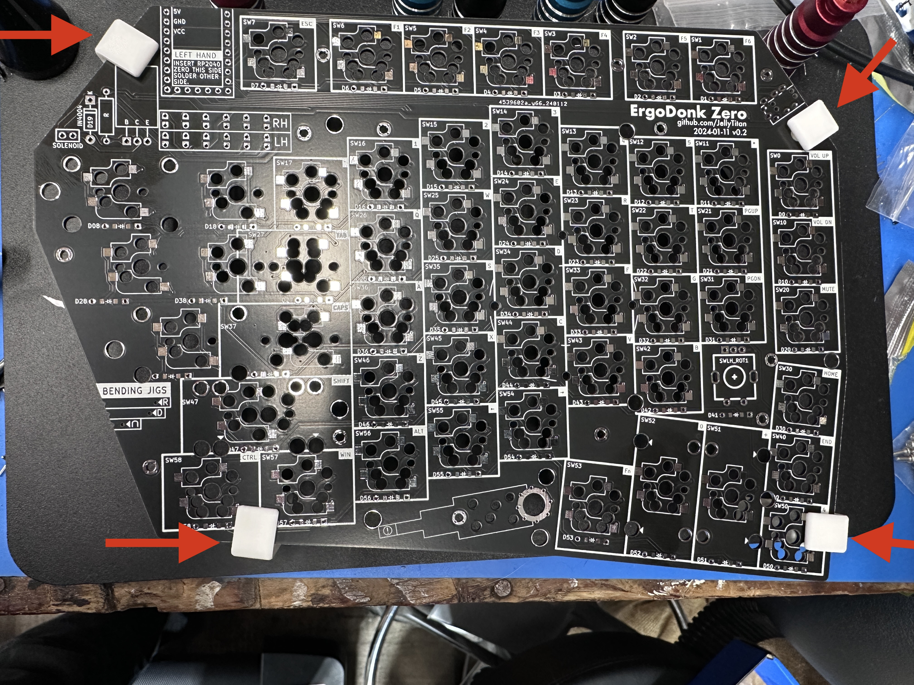
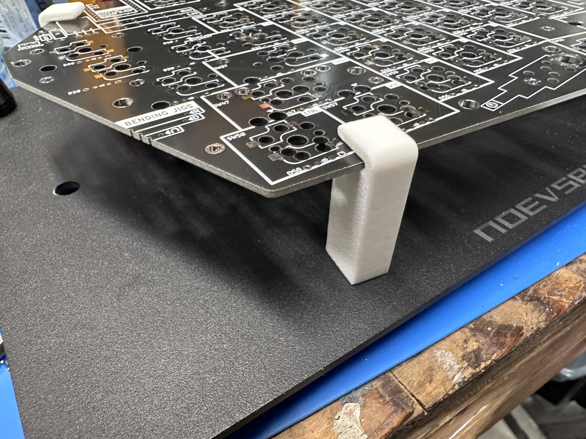

## Sofle Pico BOM (aka "Parts list")

@todo add link to basic sofle bom philosophy? Adacick did a great writeup on the part sourcing philosophy.

[Bill of Materials](#bill-of-materials)
 - [Required Parts](#required-parts)
 - [Optional Parts](#optional-parts)
 - [Tools and materials](#tools-and-materials)

## Bill of materials

### Required Parts

| Name | Count | Remarks | Potential Storefront |
| ------------------------------------ | ----------------------- | ----------------------------------------------------------------------------------------------------------------------------------------------------------------------------------------------------------------------------------------------------------------------------------------------------------------------------------------------------------------------------------------------------------------------------------------------------------- | --------------------------------------------------------------------------- |
| PCB | 2 | The PCB should be 1.6mm thick. I used JLCPCB's default settings only customizing the PCB color, and selecting 'lead free' if not using a case. | Manufacturers such as JLCPCB, LCSC, and Elecrow. [Price comparison tool](https://pcbshopper.com/) | |
| MX Hot-swap Sockets | 58 | The PCB requires sockets. Switches cannot be soldered directly to the board. | [Aliexpress](https://www.aliexpress.us/item/3256803687338432.html) |
| Diodes | 60 | Surface mount SOD-123 1N4148, or through-hole 1N4148 diode. These are common, any old one should do. Through hole is usually easier to solder. | SMD: [AliExpress](https://www.aliexpress.us/item/2251832663565152.html) [JLCPCB](https://jlcpcb.com/partdetail/3368026-1N4148SOD123/C2972760) Through-hole: [AliExpress](https://www.aliexpress.us/item/2251832473773777.html) |
| Schottky diodes | 2 | Through-hole 1N5817 diodes. These are common, any old one should do. Since you only need 2, consider getting it as part of diode kit. |  [AliExpress](https://www.aliexpress.us/item/3256805521351480.html) |
| Raspberry Pi Picos | 2 | PCB is specifically designed with the Official Pico and YD-2040 type clone in mind, however several [other clone types](https://docs.google.com/spreadsheets/d/1LPjy6F5lHfUkmsrM5zlZmc5auYy5YBakW8Awe6hYFWo) should be compatible (Waveshare, WeAct, EstarDyn, Tenstar). Although the Pico is designed with a surface mount option, the Sofle Pico is designed assuming the Pico is soldered with [headers](https://www.sparkfun.com/products/17907). The Official Pico uses Micro USB, which has been known to snap off. The USB-C variants are recommended. | [AliExpress: YD-2040](https://www.aliexpress.us/item/3256803909832318.html), [AliExpress: Tenstar](https://www.aliexpress.us/item/3256805868694592.html), [Official Raspberry Pi Resellers](https://www.raspberrypi.com/products/raspberry-pi-pico/)|
| TRRS Jacks | 2 | PJ-320A | [AliExpress](https://www.aliexpress.us/item/2255800474897706.html) |
| TRRS  (3.5mm "Headphone" Cable) | 1 | TRRS ("4 pole" required) | |
| MX Style Switches | 58 | 3-pin or 5-pin will work. If you're not using a keyplate, you'll want 5-pin.| |
| Key Caps | 58 | | |
| Rotary Encoders and Caps | 2 | EC-11 Rotary Encoder. 20mm stem is the most common. Make sure the knob matches the encoder's shaft diameter, depth and shape. SA keycaps can be quite tall, so you may want to use tall knobs as well.| [AliExpress 20mm](https://www.aliexpress.us/item/2261799870168498.html) |
| Micro USB Cable or USB-C Cable | 1 | USB cable for connecting the keyboard to your computer, dependent on what the Pico you chose uses. | | 

### Optional Parts

#### Optional - RGB

These parts are necessary for the RGB lighting.

| Name | Count | Remarks | Potential Storefront |
| --------------------------------------------- | ----- | ---------------------------------------------------------------------------------------------------------------------------------------------------------------------------------- | ------------------------------------------------------------------ |
| 74AHCT1G125 Voltage Level Shifter/ Bus Buffer | 2 | SOT23-5 Footprint     Optional - but not technically required. The Pico runs at 3.3V while the LEDs require 5V logic. If you omit this level shifter, the first LED in the circuit acts as a level shifter. In [casual tests](build_log#thermal-imaging-led-test-conclusion.), omitting the level shifter makes the board run about 6°C hotter, which is still in the acceptable Pico operating range. I'm not sure if this will eventually burn out the LEDs prematurely. | [AliExpress](https://www.aliexpress.us/item/3256803831434811.html) [JLCPCB](https://jlcpcb.com/partdetail/TexasInstruments-SN74AHCT1G125DBVR/C7484)|
| RGB SMD LEDs SK6803MINI-E | 74 | The 3MA SK6803MINI-E must be used instead of the traditional 12MA SK6812MINI-E. The SK6803MINIE-E has a smaller current draw, allowing the LEDs to be very bright at manageable wattage. | [AliExpress](https://www.aliexpress.us/item/3256803450292556.html) [JLCPCB](https://jlcpcb.com/partdetail/Normand-SK6803MINIE/C5184589)|

#### Optional - OLED
| Name | Count | Remarks | Potential Storefront |
| - | - |-|-|
| SSD1306	128x64 | 2 | These are monochromatic, usually white, yellow, or blue.     Note: There are two common variants of this OLED. One has circular holes in the corner, and the other has oval holes.   These variants have the GND/VCC pins switched. The version with the round holes is preferred, but either will work. (The round holes is installed 10mm higher, so it is preferred based solely on aesthetics.) If you come across more variants or different pin positions, please submit a PR!  | [AliExpress](https://www.aliexpress.us/item/2251832457635357.html)|
| 4 pin female headers | 2 | 2.54 pitch. ~8mm high is preferable if you'll be socketing the MCU. If you can't find 8mm, ~6mm or ~10mm is fine. |[Aliexpress](https://www.aliexpress.us/item/2251832667924622.html)|

#### Optional - MCU Sockets
This is strictly a quality of life upgrade. The [official Pico](https://www.raspberrypi.com/products/raspberry-pi-pico/) uses [Micro USB](https://en.wikipedia.org/wiki/USB_hardware#Micro_connectors) which can snap off. The MCU sockets are strongly recommended if you choose those. Alternately, many of the Pico clones offer USB-C, which is known to be less fragile. However - if your using socketed OLEDs, the OLED sockets put the OLEDs about 5mm (@todo - measure this) above the board, so socketing the MCU helps support the OLEDs.
| Name | Count | Remarks | Potential Storefront |
| - | - |-|-|
2.54mm Round Female Pin Header | 4 sets of 20 | They commonly come in strips of 40. They don't always snap in half cleanly, so get extra | [Aliexpress](https://www.aliexpress.us/item/2251832729504304.html)
Needle pin male connectors | 80 | Diode legs would also work, but these little sets of 4 are nice to work with. | [Aliexpress](https://www.aliexpress.us/item/2251832650595759.html?spm=a2g0o.order_list.order_list_main.186.15a91802YueygY&gatewayAdapt=glo2usa)

#### Optional - Case:
 - The case plates from Sofle v1, v2, RGB and Choc versions are _not_ compatible.
 - Key plates are strongly recommended, but not technically required.(If you use 3 pin MX keys, the thumb keys tend to fall out if you don't use a key plate.
 - The key plates combined with a backplate make a nice 'sandwich' case. Another plate can be added to protect the OLEDs. 
 - Spacers are intended to pass through the main pcb and screw onto the bottom plates, top plates, and OLED plates.
 - The OLEDs are taller than the switch plate, which is why they have their own separate taller plates. Acrylic is recommended for the OLED plates because the two types of OLEDs can be installed higher/lower.
 - Plates can be made from acrylic, pcb, or 3d printed.
 - Having a standoff kit is helpful when assembling the keyplates. [M2 Brass Standoff Kit](https://www.amazon.com/gp/product/B07B9X1KY6)
 - Acrylic key plates should be 3mm thick, and PCBs should be 1.6mm thick. The switches fit better in the PCBs because most switches have 'retention nubs' designed for PCBs. 
 There are designs for each of these in this repo:
    - [Acrylic](./Sofle_Pico/Case/Acrylic_case/)
    - [PCB](./Sofle_Pico/Case/PCB_case/)
    - [3d printable](./Sofle_Pico/Case/3d_printable_case/3d_printable_case.md)
@todo - add images of each of the case types here.

| Case | Acoustics | Cost | Durability | 

#### Optional - low profile header pins
- The header pins that come with the Pico are usually too long. You can either clip them off after soldering, or use [low profile header pins](https://www.aliexpress.us/item/3256805874707460.html). You only need 4, but I haven't seen them sold in quantities smaller than 50. I recommend the 20-pin 8.5mm. The 7.5mm, & 9.5mm work just fine too. If they are out of 20-pin, you can break 40-pins in twain. 

#### Optional - Pimoroni trackball - not recommended
Electrically, this works, but it's not a great experience. The footprint is there if you want to continue development. See [Pimaroni.md](pimoroni.md) for more details.

## Tools and materials

- soldering iron and solder
- no-clean flux makes soldering easier
- solder wick or desoldering pump to correct mistakes
- good tweezers
- flush cutters to trim diode legs
- masking, kapton or electrical tape
- isopropyl-alcohol for cleaning
- multimeter for troubleshooting

## Build Guide

### Soldering and workholding

There's a few common soldering methods used with through-hole components. In this guide, we'll be using the third method - "work holding". Accordingly, the docs will not reference flipping the PCB over for soldering legs.

1. **The bendy method**: Push the legs through the holes, then bend the legs slightly outward on the bottom side to keep the component in the hole when the PCB is flipped over. Solder on the side of the board opposite from the side the component was inserted.
   
1. **The tape method**: Push the legs through the holes and put a piece of kapton tape over the component to keep it in place when the board is flipped. Solder on the side of the board opposite from the side the component was inserted.
   
1. **Work holding**: Use helping hands or work holding jig to keep the PCB lifted off the work surface. Insert components through the holes, _do not_ flip the pcb, and solder on the side the components are inserted.   This is the recommended method. If you have access to a 3d printer, you can print disposable [work holding legs designed specifically for the ErgoDonk Zero PCB](https://www.printables.com/model/733164-ergodonk-zero-pcb-holding-feet).    
**[Magnetic work holding thingies](https://www.aliexpress.us/item/2255800735314797.html)**      **[3d Printable work holding feet](https://www.printables.com/model/733164-ergodonk-zero-pcb-holding-feet)** 
  
@todo: Update the feet images?
