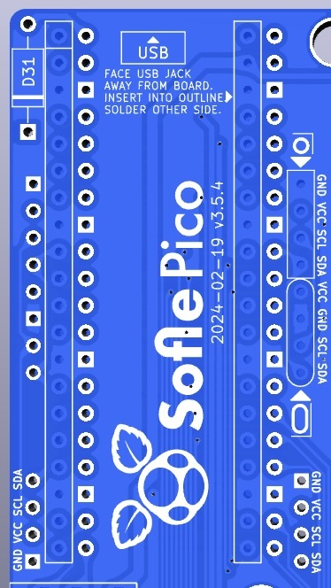
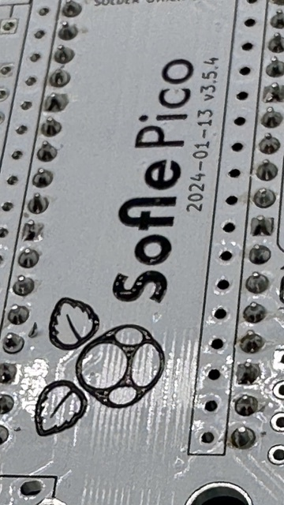
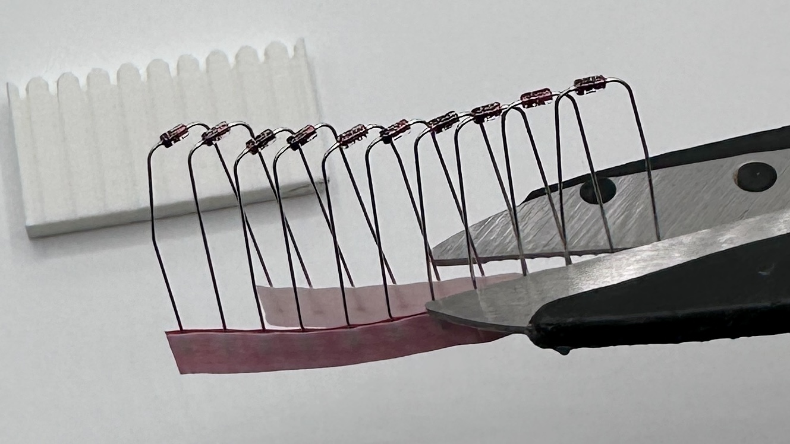
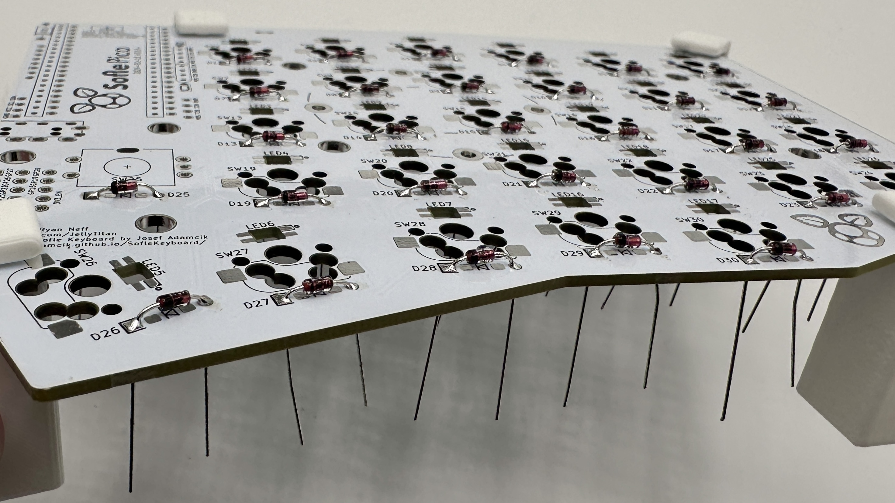
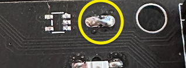
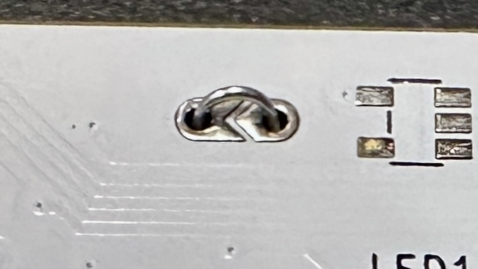
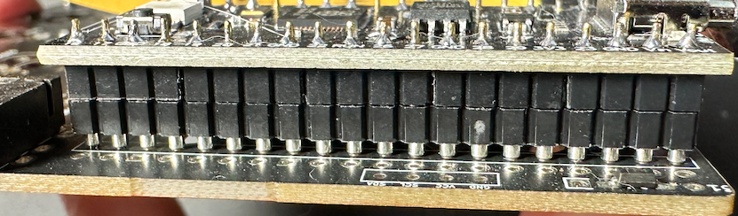
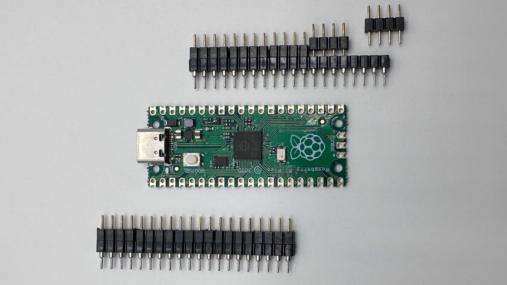
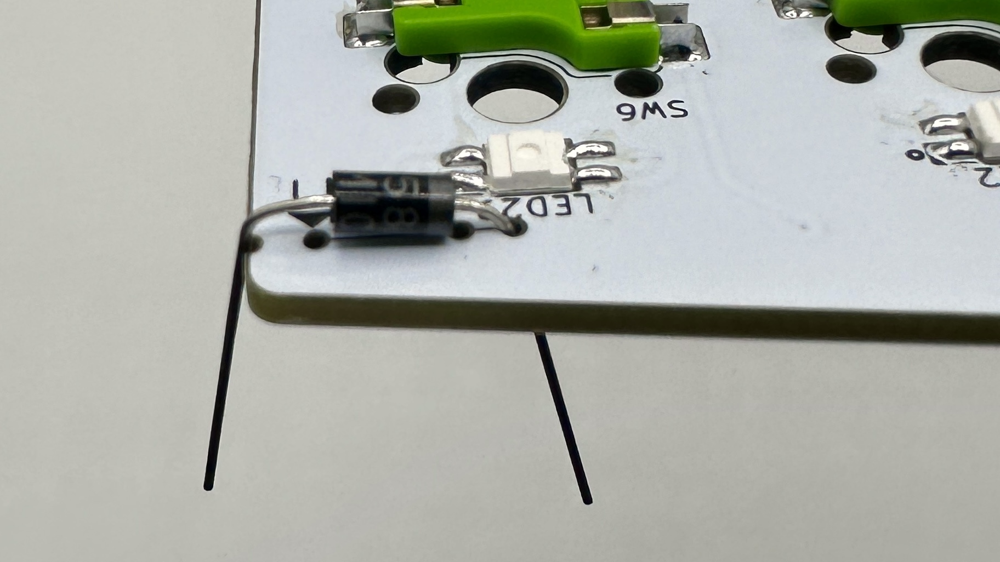
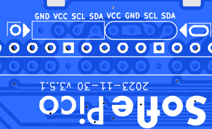

[Build Guide](#build-guide)
 - [Soldering and workholding](#soldering-and-workholding)
 - [Poka yoke](#poka-yoke)
 - [Prepare](#prepare)
 - [Diodes](#diodes)
 - [Schottky Diodes](#schottky-diodes)
 - [Switch Sockets](#switch-sockets)
 - [Level Shifter](#level-shifter)
 - [LEDs](#leds)
 - [Pico MCU](#pi-pico-mcu)
 - [OLED](#oled)
 - [TRRS Jacks](#trrs-jacks)
 - [Rotary Encoders](#rotary-encoders)
 - [Hot-swap Sockets](#hot-swap-sockets)
 - [Final assembly](#final-assembly)
 - [Warnings and disclaimers](#warnings-and-disclaimers)
 - [Firmware and programming](#firmware-and-programming)
 - [VIA](#via)

### Soldering and workholding

There's a few common soldering methods used with through-hole components. In this guide, we'll be using the third method - "work holding". Accordingly, the docs will not reference flipping the PCB over for soldering legs.

1. **The bendy method**: Push the legs through the holes, then bend the legs slightly outward on the bottom side to keep the component in the hole when the PCB is flipped over. Solder on the side of the board opposite from the side the component was inserted.
   
1. **The tape method**: Push the legs through the holes and put a piece of kapton tape over the component to keep it in place when the board is flipped. Solder on the side of the board opposite from the side the component was inserted.
   
1. **Work holding**: Use helping hands or work holding jig to keep the PCB lifted off the work surface. Insert components through the holes, _do not_ flip the pcb, and solder on the side the components are inserted.   This is the recommended method. If you have access to a 3d printer, you can print disposable [work holding legs designed specifically for the ErgoDonk Zero PCB](https://www.printables.com/model/733164-ergodonk-zero-pcb-holding-feet).    
**[Magnetic work holding thingies](https://www.aliexpress.us/item/2255800735314797.html)**      **[3d Printable work holding feet](https://www.printables.com/model/733164-ergodonk-zero-pcb-holding-feet)** 
  

### Poka yoke
When designing the Sofle Pico, an effort was made to '[poka-yoke](https://en.wikipedia.org/wiki/Poka-yoke)' the design, that is, to make the design as 'fool proof' as possible to assemble. 

Specifically, clear markings/symbols and selective masking of footprint through-holes are used to ensure that components are soldered to the correct side & in the correct orientation. Outlines indicate the side the component should be inserted into. The side with the outlines has footprint through-holes masked, so that if the user inserted the component from the wrong side, it would not be solderabe.

Please open an issue if you have a suggestion for improving the poka-yoke. I'd like to move away from English language notes on the PCB, and replace them with universal pictograms.

### Prepare

This guide includes all optional components. 

It's recommended to build the left hand first, from start to finish. I would recommend putting a piece of tape with "LH TOP" and "RH TOP" on the top of each board before you start, so when you go to build the second hand you don't build on the wrong side. (I've built 2 left hands at least twice)! 

This guide is written in the order I like to install components, starting with the components on the back, shortest to tallest:
 - diodes
 - LEDs
 - switch sockets

Then install the components on the front:
 - level shifter
 - Pico MCU & socket
 - Schottky diodes
 - OLED & socket
 - TRRS connector
 - Rotary encoder

The order of assembly does not matter **except** for these 2 components because they stack on top of one another:
1. the Pico MCU
1. the OLED screen

### Diodes
There is 1 diode per key, 1 diode on the rotary encoder.

Diodes _must_ be oriented with the white band in the direction of the "arrow" symbol on the PCB.

 

Diodes, surface mount or through-hole, can be installed on either the front or the back. The back is preferred for a cleaner look. If you are hand soldering, through hole diodes are recommended because they are easier. If you damage a pad on one side, feel free to move that diode to the other side.

For surface mount diodes, a common method is to tin one pad, place the diode on, apply the soldering iron to the diode leg until it melts the solder underneath and sinks flush with the PCB. Then come back and solder the other leg. Alternately, you can use a rework station heat gun and solder paste. (I prefer this method for smds).

For through-hole diodes, there is a bending jig on the upper right corner of the board. This is a painfully slow way to get pretty bends. 

If you've got a 3d printer handy, a printed diode [bending jig](https://www.printables.com/model/734696-diode-bending-jig-8mm) can be used to make quick uniform bends. Alternately, a carpenters pencil is roughly the right size. (The diode holes are 8mm apart, wooden pencils are often 7mm - 8mm).   

With the PCB eleveated via workholding, insert the bent diodes into the holes on the back of the board. 
Diodes _must_ be oriented with the black band in the direction of the "arrow" symbol on the PCB. There is also a black outline around the pad to make it easy to check the diode orientation is correct after the diode has been soldered in place. 

Solder the legs in place. flip over the board, and trim the legs. When you trim off the diode legs, save 2 for use as bypass jumpers. 
 

### Switch Sockets
Switch sockets installed on the back of the PCB facing up towards the front of the PCB. Make sure they are flush with the PCB. 

1. Put all the sockets in place. PCB hole tolerance can vary quite a bit, so some sockets may snap in, while others rest in the holes. If you have some that snap in, be sure to check everything is flush before you start soldering. 
1. Solder _one_ side of each socket by heating the metal connector. Apply solder and look for the solder to wick down to the PCB. You want a solid joint since this may take some mechanical strain from switch installation and removal. The 3d printed workholding feet are really handy here. You can reposition the board as you work to get the best angle for soldering those connectors.
1. Give the board a few good taps to make sure there are no loose sockets.
1. Rotate the board 180 degrees and solder the remaining sides.

 

### Level shifter
The level shifter is tiny & squirrley. It's the same size as an SMD, but with 5 pins. There is only one footprint for this component - so it will be on the front on the left hand, and on the back on the right hand. Tack one corner down, and then "[drag soldering](https://www.youtube.com/watch?v=wUyetZ5RtPs)" the remaining pins. 

Alternately, if you've decided to omit the level shifter, be sure to bridge the level shifter bypass jumper. It's next to the level shifter footprint. You can drag solder across it, or bend a diode leg and solder it through the holes. 

Modern flux core solder can make drag bridging difficult - i recommend the jumper leg method. The right-most hole on the bending jig is for this. There'You'll need to do this for both hands.

  

### LEDs

LEDs are placed on the back of the PCB. The lens should point up through the PCB so they shine into the bottom of the switch. One leg will have a diagonal cut. This cut leg should be aligned with the mark on the PCB.

To solder: tin one pad, place the LED and hold using tweezers, apply heat to the leg until the solder melts and the LED is flush with the board. Now the remaining legs can be soldered without the component moving. The LEDs are sensitive to heat. Let the LED cool between soldering each leg. Use the lowest heat needed for your solder.

Alternately, you can use a rework station heat gun and solder paste. I prefer this method for the LEDs, i think it's easier to get components to sit flush. Put a dab of solder paste on each pad, then place your LEDs with tweezers or a steady hand. (The holes above/below the LED hole are intended to make tweezer placement easier).

The LEDs are wired in one long chain. If a LED is not working, replace the LED and the LED preceding it. Sometimes just the output of a LED is damaged. The full chain does not need to be installed if you want to test a partially built board. 

 
Revisions v3.5.4 and later will have the LED number directly above the LED to make troubleshooting the LED chain easier. 

### Pico MCU

The Pico is installed on the top of the board, face up, and in the marked holes. (There are many variants of the Pico - the face up orientation ensures easy access to the reset button wherever it may be).

* Top of the board: this is the side of the PCB opposite the diodes, LEDs and switch sockets
* Marked holes: Insert the Pico into the holes with the rectangular outline on the top of the board. 

Double-check your work here. This step is hard to reverse if a mistake is made.
#### Pico MCU installed permanently with header pins
You can permanently install the Pico using the 20-pin male-male headers that came with the Pico. 
1. insert the headers into the board and the Pico both before soldering. (The header pin rows can tilt a little if it's not inserted into both the board and the Pico.) The header pins may have one longer side. Install the longer side on the PCB, because you'll need to trim these, and the trimmed pins look better on the underside of the board. Use a piece of kapton tape to attach the Pico to the PCB while soldering.

1. Flip the board over. The pins on the back of the board that you will be soldering should _not_ be in the outline. Soldering 1 of the outermost pins on each pin header on the PCB. Hold the board up to make sure the pin header is sitting flush with the pcb. If it's not, you can reheat that joint until it is flush. 
*@todo - this pick is gross - grab another without smudges and cathair.*
 
1. Solder the remaining pcb/pin header joints on the back.
1. Flip the board over. With the Pico, repeat the process of soldering & checking 1 pin with the pin header and the Pico. 
1. Solder all the remaining Pico/pin header pins.

#### Pico MCU installed with sockets
Previous versions of the Sofle used diode legs. This guide does not - instead we'll use "needle pins", which are now readily available, inexpensive, and less fussy then diode legs, but they add more height than diode legs would, which works well to support the OLEDs.

To install a socketed Pico using the diode leg approach [from splitkb.com][ProMicrosocketing]:

1. Insert the needle pins into the female sockets, and then insert the female sockets into the PCB and the Pico. Assembling the sockets/Pico/PCB before soldering ensures an excellent alignment. Be sure that the Pico is face up, and that the socket pins are inserted into the square outline on the front of the board. Applying a piece of kapton tape to hold everything in place can be helpful. 

1. Flip the board over. On the back of the PCB, solder one pin on each side, pushing down on the PCB to ensure the headers are perpendicular and fully seated. Pick up the board and inspect to insure that everything is seated flush. If it's not flush, reheat the joint and push the socket down until it's flush. (Be sure you're not touching the pin your heating when you push it down).  
1. Solder the remaining pins on the back of the pcb. 
1. Flip over the board. On the front, solder 1 pin on each side to the Pico. Again check that everything is flush before soldering the remaining pins.
  

If you ever need to remove the Pico, do it by gently prying the board up in small increments, working your way around the board. Avoid pressure on the USB connector. The diode legs are quite weak and will usually bend if you pull the Pico off in one action. A [spudger](https://www.aliexpress.us/item/3256804504939626.html) tool is really handy for this sort of thing.

### Schottky Diodes
There's one for each side. Insert on the front, right next to the MCU footprint. Be certain to orient these correctly. Solder on the back.
The leftmost hole on the diode jig is for these. 

 
  

### OLED
@todo add updated images when v3.4 prototype comes in.

There are two common variants of the SSD1306 OLED. They are easily distinguishable by the corner holes. There is a separate socket for each of these, because they switch the GND/VCC pins. This pins are usually labeled on the OLEDs themselves. 

**Please check the OLED pin labels against the marking on the PCB to ensure everything matches.** It's entirely possible that the OLEDS have GND/VCC in different locations than expected. (If you do find some that differ from the oval/round below, please update this doc ans submit a PR)! The GND pin is square.
   
 
@todo get a new picture with updated socket markings.

We will be installing the OLED so it overhangs the Pro Micro. 
1. Determine which socket your model of OLED will use.
1. Add a strip of electrician's tape to the bottom of the OLED module where it might contact the Pico. (Or a sticker)!
1. Insert the 4 pin, half height female header into the appropriate outlined footprint on the top of the PCB. On both the right and left hands, this will be to the right of the Pico. Use kapton tape to hold the socket in place while you solder the first pin. Check that the socket is perpendicular to the pcb. If it's not, reheat that solder joint and adjust.
1. Solder the remaining socket pins.
1. Push the OLED pins into the socket. You may need to trim the OLED pins so the insulation on the female and male headers mate and the OLED sits just above the Pro Micro. The downside to socketing is the OLED isn't as secure in the half height socket. When turning the keyboard upside down I find the OLED will lever away from the Pro Micro somewhat.
1. If you chose to solder the Pico without sockets, there may be a gap between the OLED and the Pico. You can add an [adhesive bumper pad](https://www.amazon.com/gp/product/B074C2XKXH/?th=1) to ensure it rests level. A rolled up piece of electrical tape will also work. 
 If you installed MCU sockets, the OLED may not seat all the way down. This is ugly, and I hate it. YMMV. 

### TRRS Jacks
Insert into the outline on the front of the board, solder on the back.
Some brands of jack will snap into the board, holding them in place while you solder. Other brands may require tape to hold them in place while you flip the board over. Solder 1 pin first to check that everything is flush and adjust as needed. Solder remaining pins.  

### Rotary encoders
Saved for last because they are tallest. Insert into the top of the board, and solder on the backside. Some EC11's have metal tabs on opposite sides that add mechanical stability - no need to solder those. Solder 1 pin first to check that everything is flush and adjust as needed. Solder remaining pins.   

### Final assembly
Installing the keys and case. (The standoff lengths mentioned assume you are using an acrylic plate).

https://github.com/JellyTitan/Sofle-Pico/assets/72168556/54e6d6f9-5af3-4b82-98af-0372871ad146

1. Place the PCB on a flat surface. This will keep the pressure distributed evenly when pressing in the switches.
1. Snap a few switches into the top plate to help align things. The corner switches work best.
1. Carefully lower the top plate with the alignment switches onto the main PCB and push into sockets. Ensure pins are aligned.
1. Snap the remaining switches into the top plate pressing into the sockets.
1. Attach the bottom plate to the five M2 6mm standoffs.
1. Place the pcb on the back plate, aligning the standoffs with holes in the PCB.
1. On the top of the pcb, attach the key plate to the standoffs using the M2 screws.
1. Use M2 screws to attach the three 18mm standoffs to the OLED cover plate.
1. Slide the three standoff on the OLED plate through the PCB. Attach those standoffs to the backplate using M2 screws.
1. Place the encoder knob on the shaft. Tighten the set screw with a hex key. A small screwdriver for glasses may do in a pinch.
1. Put at least 4 adhesive rubber feet in the corners so the keyboard is not moving when you type.

## Warnings and disclaimers
- Don't connect or disconnect the TRRS cable when the keyboard is powered. It may short out. Always disconnect the USB cable first.
- Be gentle with USB-C ports on your microcontrollers. They are easy to break.
- Keep in mind that this is a prototype of a DIY keyboard. It’s not a polished product.

## Firmware and programming

The RP2040 supports 'drag and drop' flashing with a UF2 file on Mac or PC. This is the recommended approach if you're not familiar with compiling QMK firmware yourself. 

After the first 'drag and drop' flash, you can tweak your keymaps further using [VIA](https://www.caniusevia.com/). (Using VIA is covered in the [next section](#via)).
 
### To flash with 'drag 'n drop':
1. Make sure halves are not connected together with TRRS cable.
1. Connect one half to USB.
1. Enter the bootloader using any of the following methods. These are dependant on where your RP2040 came from. You may have to remove an OLED to access the `BOOT` button.
    * Hold down `BOOT` and tap `RESET`.
    * Hold the `BOOT` button while pluging in the usb cable.
    * Double tapping the `RESET` button on the RP2040. ([Double tap reset is enabled by default on the RP2040](https://github.com/qmk/qmk_firmware/blob/master/platformdev_RP2040.md#double-tap-reset-boot-loader-entry-iddouble-tap)).
    * **Bootmagic reset** (works after you have flashed once): Hold down the top far corner key while plugging in the keyboard (`~` left half, `-` right half). This will also clear the EEPROM.
1. Wait for the OS to detect the device.
1. Copy the .uf2 file to the new USB disk.
  * The files can be found in this repo at `./Sofle_Pico/Firmware`. The VIA version is recommended: `sofle_pico_via_LH.uf2` and `sofle_pico_via_RH.uf2`.
  * There is a different file for right hand and left hand, as denoted by a `_RH` or `_LH` suffix.
  * On Mac after the file is dropped, the 'Keyboard setup assistant' may be triggered. You can ignore and quit the assistant.(@todo add relative path to UF2 files.) 
1. Unplug the side you just flashed, and repeat the process with the other side.
1. Disconnect both halves from USB.
1. Connect both halves together using the TRRS cable. 
1. Connect the left half to USB.
1. Test everything using VIA. (See [details below](#via)).

### Flashing the second time around
After the fist flash, subsequent flashes are even easier. Sofle Pico uses [Bootmagic lite](https://github.com/qmk/qmk_firmware/blob/master/feature_bootmagic.md). You can enter boot mode by holding down the upper-left-most key while pluggin in the USB cable. (Or upper-right-most, respectively). Once your in boot mode, the Pico appears as a drive, and you can drag and drop the new `.uf2` file.

### Compile your own firmware with QMK
If you want to build your own firmware, Sofle Pico uses [QMK Firmware][qmk_firmware]. Support is not in the main QMK repository [yet](@todo: Update this url with official PR). Instead use the [jellytitan/qmk_firmware](https://github.com/JellyTitan/qmk_firmware/tree/sofle_pico) fork. (Be sure to use the `sofle_pico` branch).

https://docs.qmk.fm/#/flashing?id=raspberry-pi-RP2040-uf2

To flash:
- Clone [https://github.com/jellytitan/qmk_firmware](https://github.com/jellytitan/qmk_firmware)
- Switch to the `sofle_pico` branch with `git checkout sofle_pico`
- Make sure your QMK environment [is setup][qmkintro].
- Make sure halves are not connected together with TRRS cable.
- Connect one half to USB, flash the firmware (always follow the current instructions in the QMK documentation! The command might look something like this: `qmk flash -kb sofle_choc -km default`). Use the reset button to reset the keyboard when you are asked to in console. 
- Connect the second half and flash it in the same way as the previous one.
- Disconnect the USB cable. Connect both halves together with TRRS cable.
- Connect USB cable to the **left** side.
- Enjoy!

## VIA
Until the Sofle Pico layout is merged into the official VIA repo, you'll need to load the VIA definition manually. ()
> [!IMPORTANT]
> Editing with VIA will only work after you've flashed the Sofle Pico at least once.

1. Visit https://usevia.app/
1. Open the "Settings" tab by clicking on the gear icon at the top of the page. 
1. Enable "Show Design tab".  

1. Now you should see a paintbrush icon at the top of the screen. Click on that to open the "Design tab".
1. Download the Sofle Pico via config file: [sofle_pico.json](https://raw.githubusercontent.com/JellyTitan/Sofle-Pico/main/Sofle_Pico/Firmware/sofle_pico.json). (Right click and 'Save As' to download the .json file). 
Once you have the file locally, Click "Load" to upload `sofle_pico.json`.  (The Sofle Pico PR for VIA can't be submitted until the QMK PR is submitted and approved. That PR is waiting and ready to go: [VIA PR for Sofle Pico](https://github.com/JellyTitan/keyboards/blob/sofle_pico/v3/sofle_pico/sofle_pico.json)). 

1. After the definition is loaded, you will be asked to authorize a connection to your device.  
1. Clicking on the "Configure" tab will let you modify your layout. 

