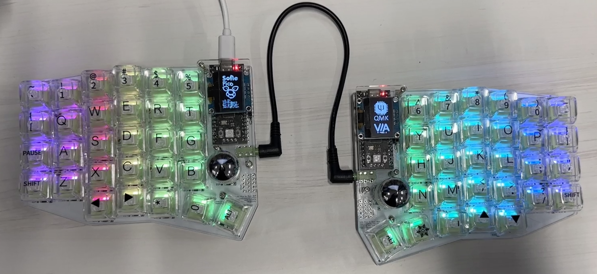
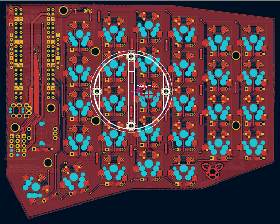
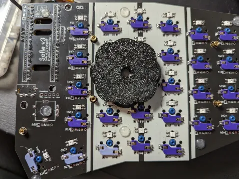

# Sofle Pico Split Keyboard


{: .new }
> This hardware is now stable with release [v3.5.4](https://github.com/JellyTitan/Sofle-Pico/releases). 
> The QMK PR is in review. The VIA PR is in draft. The documentation is still in progress. You can see the punch list on the [status](/status) page.

Sofle is 6×4+5 keys column-staggered split keyboard with encoder support, per-key RGB, dual 128x64 OLEDs, and uses the RP2040 based Raspberry Pi Pico MCU. 

 

- [Sofle Pico Split Keyboard](#sofle-pico-split-keyboard)
  - [Overview](#overview)
    - [Pico vs. ProMicro](#pico-vs-promicro)
    - [Features inherited from Sofle V2](#features-inherited-from-sofle-v2)
    - [Key placement comparison between Sofle variants](#key-placement-comparison-between-sofle-variants)
    - [New features in the Sofle Pico](#new-features-in-the-sofle-pico)
    - [Notable changes](#notable-changes)
  - [Firmware](#firmware)
  - [About the project.](#about-the-project)
  - [License](#license)

## Overview

### Pico vs. ProMicro
Whereas [Sofle v1 & v2](https://github.com/josefadamcik/SofleKeyboard) used the ProMicro MCU, Sofle Pico is built specifically for the RP2040 Pico MCU. The Pico offers larger memory options at a low price point. [Inexpensive clones are readily available](https://www.aliexpress.us/w/wholesale-raspberry-pi-pico.html). The increased MCU capacity of the Pico has plenty of space for OLED and RGB animations.

Although there is a QMK option to port the legacy ProMicro config to RP2040 boards that are backwards compatible, some RP2040 pins are not 5v tolerant. Essentially, the per key rgb doesn't always work as it should.

There are many RP2040 boards available in the same form factor as the ProMicro, but they tend to be 4-8 times more costly than the Pico form factor, and there are plenty of inexpensive [Pico clones](https://docs.google.com/spreadsheets/d/1LPjy6F5lHfUkmsrM5zlZmc5auYy5YBakW8Awe6hYFWo/edit#gid=0).

Accommodating the voltage variances between the ProMicro and the Pico required drastic wiring changes which results in the loss of backward compatibility with Sofle v1/v2 firmware. The SK6812MINI-E LEDs commonly used with ProMicro keyboards require 5v logic. The Pico uses 3.3v logic, so it uses a lower current LED variant, specifically the SK6803MINI-E. Thank you to Dane Skalski and the [Junco](https://github.com/Daneski13/Junco#optional---rgb) for providing this excellent 3V logic circuit.

### Features inherited from Sofle V2
 - Key placement has not changed. (mostly - 1 thumb key got a 3 degree rotation).
 - Hotswap sockets are required. 
 - Per-key RGB remains optional and uses the _relatively_ easy to solder SK6803 MINI-E LEDs.

### Key placement comparison between Sofle variants



### New features in the Sofle Pico
* Default OLED is now 64x128, as opposed to 32x128.
* OLED ports are separated and offset, so no jumper soldering is required.
* 2 Common SSD1306 64x128 OLED variants are supported. The two common variants are circle corner and oval corner, which have different pinouts. There may be more pinout variants out there! (Please submit a PR if you come across them)!
* Added easily accessible [Pimoroni trackball](https://shop.pimoroni.com/en-us/products/trackball-breakout) tie in footprint. It works, but it's still a Pimoroni - so IMO it's still not a great experience. Your mileage may vary. 
* Simplified the PCB & improved labeling to help with build troubleshooting. (The addition of a GND & VCC planes specifically).
* Added through-hole/smd hybrid footprints for the per-switch diodes. (Making for easy manual assembly or automated assembly).
* Added a 'breakout' section for the unused Pico pins to allow for easy tinkering.
* The default communication protocol is full duplex TX/RX.
* Should be able to support [Cirque trackpads](https://shop.beekeeb.com/product/40mm-cirque-glidepoint-circle-trackpad-module-diy-kit-for-split-mechanical-keyboard/) that use a breakout board to tie into the i2C bus. (I haven't tried this yet - please submit a PR if you can validate).

### Notable changes
* Improved labeling and footprint masking to poke-yoke the build process.
* 3 degree rotation of the innermost thumb key. 
* Sofle V1 & V2 firmware is not compatible due to the complete rewire for the Pico.
* MCU footprints side-by-side to reduce potential shorts.
* Modified thumb cluster outline to accommodate 1.25u thumb keycap.
* Added teardrops to decrease likelihood of acid traps during manufacture.
* Added VCC & GND net to simplify routing.
* Poka-yoke TRRS footprint by removing unnecessary solder masks.
* Diode placement & labeling improved for easier troubleshooting.
* Diodes can be installed on the front or back, making for lower cost PCBA.
* Reset button removed. It is no longer needed, as the Pico has a physical rest button.
* The MCU is now facing upward. There are many PiPico board variants with buttons placed differently. Facing the MCU upward ensures accessability.

* Tenting puck mounting holes added. [SplitKB](https://splitkb.com/products/tenting-puck) or 3d print your own: design by [
Bubbleology](https://www.printables.com/model/235433-tenting-puck-for-keyboard-tripod-mount/comments/943096).

 

## Firmware 

Sofle uses [QMK firmware](https://qmk.fm/). The [QMK PR](https://github.com/qmk/qmk_firmware/pull/23338) is still in progress, and is not yet in the main branch.

The Sofle Pico can be flashed using 'drag and drop' .uf2 files, and then the config can be modified using [VIA](https://www.caniusevia.com/). 

The Sofle Pico can't be added to the official VIA repo until it's in the master branch of QMK. Until then, the [via config can be manually uploaded](/flashing/via) using the web interface.

## About the project.

The Sofle Pico was designed by [Ryan Neff](https://github.com/JellyTitan) with the help of [uberrice](https://github.com/uberrice). The Sofle Pico is based on the excellent Sofle Choc designed by [Brian Low](https://github.com/brianlow), which is based on the fantastic Sofle RGB by [Dane Evans](https://github.com/DaneEvans) which was based on the Sofle v2 by [Josef Adamčík](https://github.com/josefadamcik). 

The MX footprints came from the highly regarded foostan [kbd library](https://github.com/foostan/kbd). 

Thank you to [Dane Skalski](https://github.com/daneski13) and the [Junco](https://github.com/Daneski13/Junco#optional---rgb) for providing a viable Pico LED level shifting circuit.

## License
Sofle Pico is distributed by an [MIT license](https://github.com/JellyTitan/Sofle-Pico/blob/main/LICENSE).
