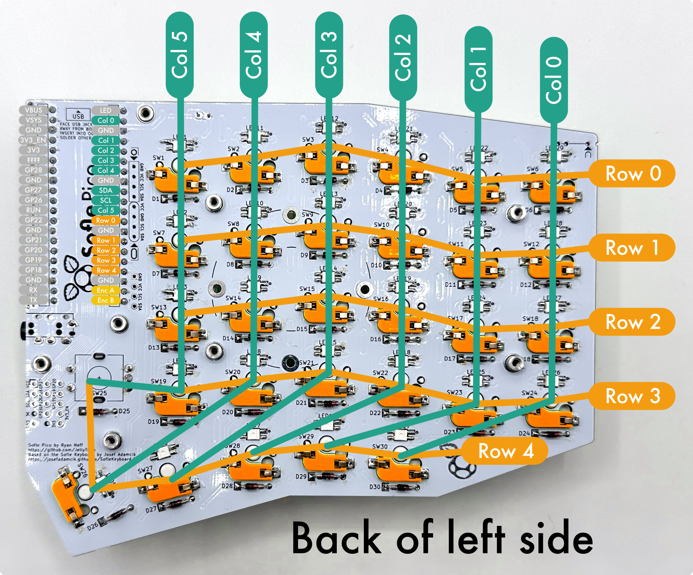
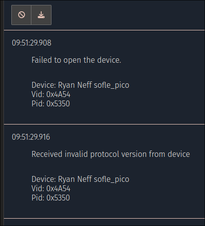

# Troubleshooting
{: .no_toc }

{: .warning}
> This is still a work in progress! If you find a problem & solution not listed here, please add it using the 'edit on github' link at the bottom of this page.

This troubleshooting guide has been heavily influenced by prior Sofle generations and guides, such as the [Sofle Choc troubleshooting guide](https://brianlow.notion.site/Troubleshooting-3633bac9a74b4f0298151b437c992e53), the [Junco build guide](https://github.com/daneski13/Junco?tab=readme-ov-file#troubleshooting), as well as the [Sofle Pico Github issues](https://github.com/JellyTitan/Sofle-Pico/issues). 

## Table of contents
{: .no_toc .text-delta }

1. TOC
{:toc}

## Where to get help

* You can open an issue on Github [https://github.com/JellyTitan/Sofle-Pico/issues](https://github.com/JellyTitan/Sofle-Pico/issues)
* You can start a larger discussion in the [Sofle Pico Github discussions page](https://github.com/JellyTitan/Sofle-Pico/discussions).
* Not directly related to Sofle Pico, but there are many helpful folks on the [r/olkb](https://www.reddit.com/r/olkb/), [r/mechanicalKeyboards](https://www.reddit.com/r/MechanicalKeyboards/), [r/ErgoMechKeyboards](https://www.reddit.com/r/ErgoMechKeyboards/) and for all things QMK related, the [QMK Discord](https://discord.com/invite/fBGYurv). 

## LED's 

### No LEDs are working
* Verify that the Pico is getting power.
* Verify that LED1 is oriented correctly and all the legs are soldered.
* Sofle Pico versions 3.5.4 and earlier have a footprint for a level shifter component. This part was unnecessary, as the first LED in the chain acts as a level shifter. The level shifter footprint is in the LED power chain, so the level shifter bypass jumper needs to be bridged so that power makes it to the LEDs. Verify that the level-shifter bypass jumper has been bridged. If your board has the footprint/bridge, it will be located above LED1.  

### Some LED's are not working or are flickering.
1. Check that the LED not turning on is in the correct orientation. (The leg with the notch should be aligned with the marked pad).
1. Check that the pads of LED not turning on and its previous are soldered correctly, re-solder for a better connection as needed.
1. If the soldering looks good and the orientation is correct, try re-soldering all the pads any way for good measure.
1. If re-soldering didn't work than the LED is likely dead or damaged in which case replace it. 

## Switches

### A single key is not working
1. Check switch socket soldering. Are there any visible gaps or 'wiggle'?
1. Check for excess solder possibly bridging a nearby trace. [Use solder wick](https://www.youtube.com/watch?v=Vou2xlJkuoU) to remove excess solder. 
1. Check the diodes near the switch are soldered and in the correct orientation. For surface mount diodes, the white band should be closer to the outlined pad. For through-hole diodes, the black stripe should be closer to the outlined pad.
2. Try shorting the switch socket pads with a pair of tweezers or a paperclip. If a key press is registered, then the problem is with the switch, socket, or diode. If no key press is registered when shorting, the problem is elsewhere.

### An entire row or column of keys is not working
1. Likely a problem with the PCB's connection to the Pico.
1. Check that all diodes in the row or column have the correct orientation and good solder joints.

### Shorting pins to simulate a key press.

Click to zoom:

 

Manually trigger a key press by using a piece of wire  or paperclip to connect a `Row` pin with a `Column` pin. This is called shorting pins. Shorting pins bypasses components on the PCB letting you isolate the problem. The right and left hands have Pico pins in different locations, as indicated in the diagrams above. Note that the column and row count numbering begins with `0`.

For example:

- to trigger the LH `B` key or RH `N` key, short `Row 3` and `Col 5` pins.
- to trigger the LH `Q` key or RH `P` , short `Row 1` and `Col 1` pins.
- to trigger the encoder button, short `Row 4` and `Col 5` pins.

{: .danger }
> Avoid shorting the `VCC` pin and LEDs. This can burn out other pins on the Pico. 

I recommend testing with just one half connected. If you have used unique firmware for each hand, then each hand will be recognized correctly when plugged in seperately. If you used the same firmware for both hands, then plugging in only one side will cause the single side to be recognized as the left side. 

## VIA

### VIA error 'failed to open device' or 'Received invalid protocol from device'
 This can happen when trying to connect to VIA. Not sure what the root cause is. Users report it can be fixed by re-flashing the Pico's.[^2] Be sure you're using the VIA specific uf2 files: `sofle_pico_via_RH.uf2` & `sofle_pico_via_LH.uf2`.

## QMK
As of May 5th 2024, there is a QMK PR open to add the Sofle Pico. See the <a href="flashing/qmk">flashing help page</a> for more details. 

## Miscellaneous

### Plug in the USB cable and nothing happens
Cheap cables shipped for charging toys/lights/gadgets sometimes leave out the data-wires or don't actually implement the reversible pin-out on the USB-C connectors. Try flipping the USB-C connecter over. If that doesn't work, any spares from USB-C cellphones will likely be fine as they'll be guaranteed to have all the connections and thicker wire suitable for USB 3.0 power delivery.[^1]

## Footnotes
[^1]: Based on issue '[Some USB Cables don't work](https://github.com/JellyTitan/Sofle-Pico/issues/14)'.
[^2]: Based on discussion '[VIA not working](https://github.com/JellyTitan/Sofle-Pico/discussions/18)'.