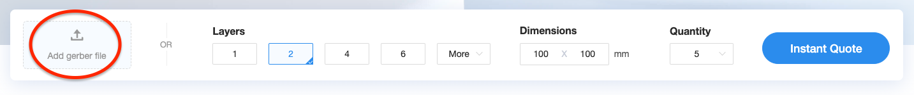
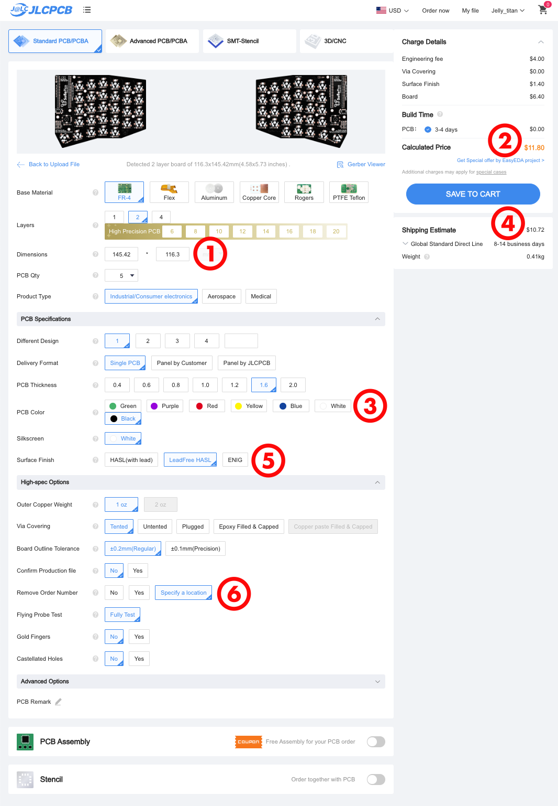
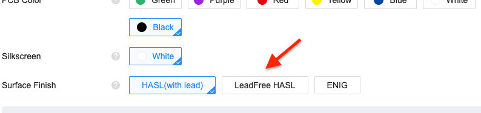

# PCB Ordering Guide.

How to order this board from a PCB vendor - helpful info if it's your first time ordering a PCB.

Most PCB vendors have a similar ordering process. I use [JLCPCB](https://jlcpcb.com/) because they are usually the most cost effective. I've had good luck with [Elecrow](https://www.elecrow.com/) too. [You can find PCB price comparison tools online.](https://pcbshopper.com/) When comparing pricing, be sure to enter the board dimensions, and set the minimum quantity to 5. Usually anything under 100x100mm is really inexpensive - so be sure to use actual dimensions when pricing. Most manufacturers have a 5 board minimum, so this is a safe quantity to start with.

| Board    |Width (mm)|Height (mm)|
|    ----: |  :----:  |  :----:   |
|Sofle V1  |137       |110        |
|Sofle V2  |144       |116        |
|Sofle RGB |138       |112        |
|Sofle Choc|144       |113        |
|Sofle Pico|146       |117        | 

Usually the minimum quantity to order is 5 boards. All the Sofle boards have been designed to be double sided, so a batch of 5 boards gets you 2 & 1/2 sets of Sofle.

The production files are known as "gerbers", and they are usually uploaded as a `.zip` file. (It's essentially a collection of files for each layer of the board, like holes, graphics, traces etc.) 

@todo Some Sofles don't have a zip of the Gerbers in each folder. Can we change that?
In this repo, the gerber file for each Sofle variant can be found in it's subfolder under PCB's/
@todo: link to each variant here:

The homepage of JLCPCB has a drag & drop upload. Drag the gerber `.zip` and drop it on the "add gerber file" box.

While the file is uploading, it will take you to an options screen. Once the board size is detected1, the price3 will update accordingly.
Changing the pcb color2 may impact production time and price.
Shipping estimates4 can vary widely, so be sure to check those. (You'll see these options again during checkout).

It's worth noting, the default pcb surface finish contains Lead. For boards in cases, this is usually not a problem. If you're going to rock a naked board, consider going with "lead free"5 for a few bucks more. The more popular colors like green and black tend to cost less for the lead free option.

By default, all JLC boards have a part number printed on them. (Most people won't notice them unless your looking for them). You can pay extra to have them removed. Some Sofle versions support the option to "Specify a location"6. (Essentially this is a line of text on the PCB that will JLC will substitute with their part number.) There is no additional charge for specifying the location. The following Sofle variants support this option:

@todo do any Sofles besides Pico do this?

The remainder of the checkout process is standard ecommerce stuff. After you pay for your order, it will be reviewed before going into production. They will let you know if the file has any issues.
