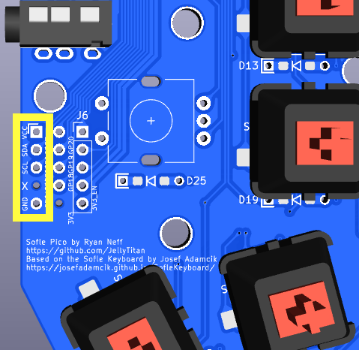
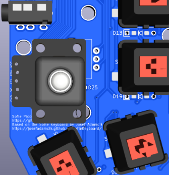

# Sofle Pico Pimoroni Support

The Sofle Pico was designed for Pimoroni support on the right hand in lieu of a rotary encoder. The outermost column of pins on the patch bay on the right hand line up with the Pimoroni pin out. However - after trying it out, the experience is not great, so it's not recommended.  The cursor movement is 'jenky' at best. 

 

QMK does [officially support](https://docs.qmk.fm/#/feature_pointing_device?id=pimoroni-trackball) the Pimoroni. There may be a way to improve the jenky movement in QMK. 

If you find a way to make this work well, please submit a PR. 

An additional mounting bracket will likely need to be designed to position the trackball comfortably, positioned above the pcb and angled toward the thumb.

Jenky movement expmple:

<video  controls>
  <source src="docs/images/pimoroni/jenk_mouse.mov" type="video/mp4">
</video>
