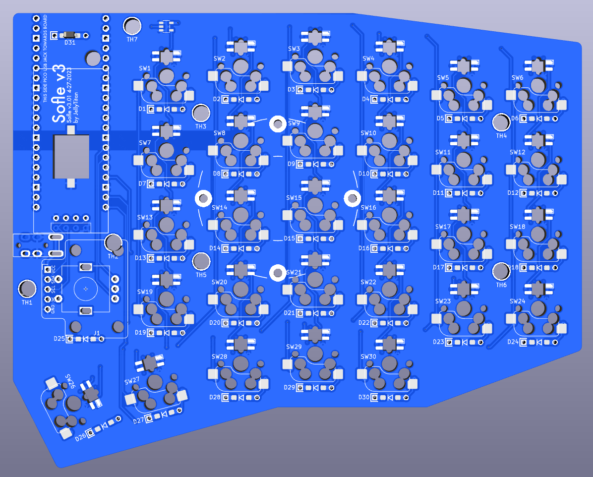

The Sofle V3 is based on the key layout of the Sofle V2 split keyboard. The V3 has been refactored to use the rp2040 based Pi Pico mcu. 

- [Sofle V3 vs V2](#design-philosophy-and-quirks)
 - [Pi Pico vs. ProMicro](#pi-pico-vs.-ProMicro)
 - [Features inherited from V2](#features-inherited-from-v2)
 - [New features in V3](#new-features-in-v3)
 - [Notable changes](#notable-changes)
- [Build Guide / Assembly](#build-guide--assembly)
 - [Parts](#parts)
 - [Required](#required)
 - [Optional - RGB](#optional---rgb)
 - [Optional - OLED](#optional---oled)
 - [Optional - piezo speaker](#optional---piezo-speaker)
 - [Optional - Pimaroni trackball](#optional---pimaroni-trackball)
 - [Soldering](#soldering)
 - [Diodes](#diodes)
 - [RGB (Optional)](#rgb-optional)
 - [Pico](#pico)
 - [Hot-swap Sockets](#hot-swap-sockets)
 - [TRRS jack and Rotary Encoders](#trrs-jack-and-rotary-encoders)
 - [Case](#case)
 - [Flashing the firmware](#flashing-the-firmware)
- [Troubleshooting](#troubleshooting)
 - [No LEDs are working](#no-leds-are-working)
 - [Some LEDs are not working](#some-leds-are-not-working)
 - [An entire row or column of keys is not working](#an-entire-row-or-column-of-keys-is-not-working)
 - [Random key or keys not working](#random-key-or-keys-not-working)

# Build Notes
** 5-29-23 New prototype sent out for production. **

The hotswop sockets and LEDs are in a single combo footprint. This is great for design, but a PITA for automated production. Need to create a placebo to generate proper PNP/BOM files. Or sepertate the symbol/footprint. 
Validate that the first sk6812 acts as a level shifter, then remove the level shifter bypass.

## Sofle V3 vs V2

### Pi Pico vs. ProMicro
Whereas Sofle v1 & v2 used the Promicro MCU, V3 uses the Pi Pico which offers larger memory options at a low price point, which allows for more features like screen animations and RGB animation effects.

Although there is a QMK option to port the legacy pro-micro config to rp2040 boards that are backwards compatible, the rp2040 pins are not 5v tolerant. Essentially, the per key rgb doesn't work as it should.

There are many rp2040 boards available in the same form factor as the Promicro, but they tend to be 4-8 times more costly than the Pi Pico formfactor, and inexpensive Pi Pico clones are readily available.

Pi Pico has a larger form factor. Sofle's have traditionally had a cutout above the thumb cluster, which is now occupied by the pi pico, so some of the aesthetic heritage is lost. PCB manufacturing generally charges by the square mm, so there was no additional cost from a production perspective.

Accommodating the voltage variances between the Promicro and the Pi Pico required drastic wiring changes which results in the loss of backward compatibility with Sofle v1/v2 firmware. The mini-e LEDs commonly used for keyboards require 5v logic, which was used by the Promicro. The Pi Pico uses 3.3v logic. A level shifter, along with a lower current variant of the mini-e make this work. Thank you to the [Junco](https://github.com/Daneski13/Junco#optional---rgb) for providing a viable 3V logic circuit.

### Features inherited from V2
 - Hotswap sockets are required. 
 - Per-key RGB remains optional and uses the relatively easy to solder SK6812 MINI-E LEDs. (Note lower current variant required for v3)
 - Key placement has not changed. (mostly - 3deg thumb key rotation).

### New features in V3
* ~~Piezo speaker added.~~ Not viable at this time.
* Default OLED is now 64x128, as opposed to 32x128.
* OLED ports are separated and offset, so no jumper soldering is required.
* Added clearly labeled and easily accessible [Pimoroni trackball](https://shop.pimoroni.com/en-us/products/trackball-breakout) tie in footprint.
* Drastically simplified the PCB & improved labeling to simplify build troubleshooting. (The addition of a GND & VCC planes specifically).
* Added through-hole/Surface mount hybrid footprints for the per-switch diodes.

### Notable changes
* Improved labeling and footprint masking to poke-yoke the build process.
* 3 degree rotation of the innermost thumb key. 
* Sofle V1 & V2 firmware is not compatible due to the complete rewire for pipico.
* Removed the I2C bus. (This allowed collapsing & of the TRRS/TRS footprint).
* Added drill holes above the mini-e hole to allow for easier tweezer placement.
* Collapsed the double MCU footprint to a single footprint to simplify routing. (One half of the board now has the MCU face up, the other face down.)
* Removed I2C Bus implementation.
* Moved _all_ mounting holes, both those between keys and those used for the screen cover.
* Modified thumb cluster outline to accommodate 1.25u thumb keycap.
* Rounded board corners with a consistent radius. 
* Added teardrops to decrease likelihood of acid traps during manufacture.
* Added a VCC net to simplify routing.
* Poka-yoke TRRS footprint by removing unnecessary solder masks.
* Tweaked diode placement & improved labeling for easier troubleshooting.
* Removed reset button. It is no longer needed, as the Pico has a physical rest button, and modern QMK can put the board into bootloader mode with 'QK_BOOT' key. The hardware reset button would likely only be used once, if at all.
* Resolved the bulk of KiCad DRC violations. (A few edge clearance violations remain - but nothing electrically relevant).
 - @todo Added rally stripes
 - @todo possible rotary encodor or switch socket?

## Build Guide / Assembly

### Parts

#### Required

Where "56-58" is the count, 58 is needed with 2 rotary encoders. subtract from 58 every additional encoder (4 encoders 56, with 3 encoders 57).

| Name | Count | Remarks | Potential Storefront |
| ------------------------------------ | ----------------------- | ----------------------------------------------------------------------------------------------------------------------------------------------------------------------------------------------------------------------------------------------------------------------------------------------------------------------------------------------------------------------------------------------------------------------------------------------------------- | --------------------------------------------------------------------------- |
| PCB | 2 (1 left and 1 right) | PCBs can be ordered from manufacturers such as JLCPCB, LCSC, and Elecrow. | |
| MX Hot-swap Sockets | 56-58 | | |
| SMD Diodes | 62 | Surface mount SOD-123 1N4148, or through-hole 1N4148 diode. These are common, any old one should do. Through hole is usually easier to solder. | [AliExpress](https://www.aliexpress.us/item/2251832663565152.html) |
| Raspberry Pi Picos | 2 | PCB is specifically designed with the official Pico and YD-2040 type clone in mind, however several [other clone types](https://docs.google.com/spreadsheets/d/1LPjy6F5lHfUkmsrM5zlZmc5auYy5YBakW8Awe6hYFWo) should be compatible (Waveshare, WeAct, EstarDyn, Tenstar). Although the Pico is designed with a surface mount option, the Sofle V3 is designed assuming the Pico is soldered with [headers](https://www.sparkfun.com/products/17907).| [AliExpress, YD-2040](https://www.aliexpress.us/item/3256803909832318.html) |
| TRRS Jacks | 2 | PJ-320A | [AliExpress](https://www.aliexpress.us/item/2255800474897706.html) |
| TRRS or TRS Cable (3.5mm "Headphone" Cable) | 1 | TRRS (4 pole) or TRS (3 pole) will work. | |
| MX Style Switches | 58 | | |
| Key Caps | 58 | | |
| Rotary Encoders and Caps | 2 | EC-11 Rotary Encoder. 20mm stem is the most common, but this doesn't extend much above tall keycap profiles like SA. 30mm is nice if available. | [AliExpress 20mm](https://www.aliexpress.us/item/2261799870168498.html) [AliExpress 30mm]( https://www.aliexpress.us/item/3256804910318088.html) |
| M3 6mm or 6mm+ Screws and Nuts | 8 | @todo - update? | |
| Case | 1 Left Set, 1 Right Set | Case files are located in the [case folder](./Case). | @todo - update? |
| Micro USB Cable or USB-C Cable | 1 | USB cable for connecting the keyboard to your computer, dependent on what the Pico you chose uses. | |

#### Optional - RGB

These parts are necessary for the RGB lighting.

| Name | Count | Remarks | Potential Storefront |
| --------------------------------------------- | ----- | ---------------------------------------------------------------------------------------------------------------------------------------------------------------------------------- | ------------------------------------------------------------------ |
| 74AHCT1G125 Voltage Level Shifter/ Bus Buffer | 2 | SOT23-5 Footprint     Required for LEDs to work properly, Pico runs at 3.3V while the LEDs will require 5V | [AliExpress](https://www.aliexpress.us/item/3256803831434811.html) |
| RGB SMD LEDs (Prefer SK6803MINI-E) | 74 | The 3MA SK6803MINI-E is highly recommended over the more traditional 12MA SK6812MINI-E due to its smaller current draw, allowing the LEDs to be very bright at manageable wattage. | [AliExpress](https://www.aliexpress.us/item/3256803450292556.html) |

#### Optional - OLED
| Name | Count | Remarks | Potential Storefront |
| - | - |-|-|
| SSD1306	128x64 | 1-2 | These are monochromatic, usually white, yellow, or blue.     *!Note - at the time this board was built, the 128x64 SSD1306 OLED is not officially supported on ARM boards. (Pico is ARM, promicro is AMD). The 128x32 version has been validated thoug. @todo - verify 64 & submit PR? | [AliExpress](https://www.aliexpress.us/item/2251832457635357.html)|

#### Optional - Piezo speaker
| Name | Count | Remarks | Potential Storefront |
| - | - |-|-|
| 1109 SMD piezoelectric buzzer| 1-2 | The 1109 refers to the dimensions 11mm x 9mm. When buying from Aliexpress, these are often advertised along with other Piezo's, so be sure to check for 1109 specifically.|[keeb.io](https://keeb.io/products/piezo-speaker) [AliExpress](https://www.aliexpress.us/item/3256804600201669.html)|

#### Optional - Pimoroni trackball
| Name | Count | Remarks | Potential Storefront |
|-|-|-|-|
| Pimoroni trackball | 1 | The default footprint replaces a rotary encoder. Installing flush to the board is a bit too low to be comfortable, so you may want to raise it. @todo elaborate.|[Pimoroni](https://shop.pimoroni.com/en-us/products/trackball-breakout)|

Regarding top plates:
 - The top plates from Sofle v1, v2, RGB and Choc versions are not compatible, because the mounting holes have moved to accommodate Choc V2 footprints.
 - The solenoid & the screen are taller than the switch plate, so they have their own separate taller plates.
 - Spacers are intended to pass through the main pcb and screw onto the bottom plates, top plates, and solenoid/oled plates. 

The Sofle Click was designed by [Ryan Neff](https://github.com/JellyTitan), based on the excellent Sofle Choc designed by [Brian Low](https://github.com/brianlow), that is based on the fantastic Sofle RGB by [Dane Evans](https://github.com/DaneEvans) which was based on the original Sofle v2 by [Josef Adamčík](https://github.com/josefadamcik). The Choc V2 footprints came from the well-regarded foostan [kbd library](https://github.com/foostan/kbd). 

## Updated Build Guide and Kits

@todo - write this.

## Bill of materials

The following is needed to build the keyboard:

- **2 PCBs**. Send the zip from `/Gerbers/Choc_mx/choc-mx-gerber-pcb.zip` to a PCB fabrication service. 
The PCB should be 1.6mm thick. I used JLCPCB's default settings only customizing the PCB color. 
@todo refresh Gerbers and update path
@todo: Mention "Lead free" 
@todo: Mention Jlcpcbpart number placement
@todo: seperate jlcpcb gerber?
@todo: revise this -> See [sourcing][sourcing].

- **2 Pro Micro** boards or clones. 5v, 2x12 pins, ATmega32U4 microcontroller. **Don't** buy the Arduino Micro (a different pinout) or Arduino Mini (different microcontroller). You could also use Elite-C which basically Pro Micro with USB-C.
Although QMK supports conversion to pi2040 boards, they are usually not 5v tolerant and may cause issues with the LED's. 
@todo verify this.

- **4x 12 pin headers (and optional sockets)** for Pro Micros. There are several ways to mount Pro Micros to the board. The male pin headers you most likely got with the board can be used to solder it directly to the board. This makes it hard to replace the board if it fails. The micro-USB connector is known to tear off. ~~I socketed the Pro Micro using the diode legs approach [described at splitkb.com][promicrosocketing] with two 12-pin female headers. This is the option descibed in the build guide here. Lastly, [these spring pin headers][springpinheader] are used on similar keyboards and should give a compact, non-permanent connection but have been out of stock for a long time.~~
@todo link to cheap sockets

- **58 Kailh Choc keyboard switches**. Must be [Kailh Choc v1 switches (PG1350)](https://deskthority.net/wiki/Kailh_PG1350_series) of any color, or [Kailh Choc v2](https://deskthority.net/wiki/Kailh_PG1353_series) of any color. The `PG` prefix is often omitted. **Don't** buy , [Kailh Mini Choc](https://deskthority.net/wiki/Kailh_PG1232_series) or [Cherry MX](https://deskthority.net/wiki/Cherry_MX).

- **58 Kailh Choc keyboard switch sockets**. Sockets are specific to the PG1350 switch. The PCB requires sockets. Switches cannot be soldered directly to the board.

- **58 keycaps**. You can use either all in `1u` size but it looks nicer with two `1.5u` for the thumb keys.
@todo link to choc v1 and choc v2 caps. 
@todo - I heard that some MX caps dont' work with choc v2?

- **58 diodes**. 
 -- Surface Mount: 1N4148W surface mount diodes in SOD123 package. Pick any common variation. I used `1N4148WTR` (Digi-Key 1655-1360-1-ND).
 
 Alternately, you can use through hole diodes, which are easier to solder. These will be _mostly_ hidden under mx keycaps. 
 @todo - modify thumb cluster diode placement? What about rotary diode?
 
 -- Through hole: 1N4148 through hole diode. These are common, any old one should do.

- **2 TRRS connectors**. The same type which is used for Corne, Lily58 etc. Technically even TRS should work if you stick to the default serial communication.

- **1 TRRS cable**. TRS should work if you stick with the default serial communications.

- **8 - 10 silicone bumpers**. Used for feet to keep the keyboard from moving

- **Micro USB Cable** to connect the keyboard to a computer.

Optional components:

- **OLED/s**
 - **2 SSD1306 128x32 OLED display module**. 4-pin, I2C, 0.91". Very common.
 @todo - can we upgrade to 128x64?
 - **2x 4 pin header (and optionally socket)** for OLEDs. These came pre-soldered to the OLED unit. You can solder the OLED directly to the board. Ideally use a socket so you can replace and/or get at the ProMicro underneath. I found 4 pin female headers with half height (~4mm) insulation worked well
 - **2 OLED covers** This should be compatible with the Sofle RGB cover but have not verified
 @todo design these

- **Rotary encoders**
 - **2 Rotary encoders EC11**. If you are not sure take EC11E. Some other variants (EC11K) may have some additional plastic pins for and require mounting holes for them which are not included on the PCB. 
 The standard shaft height is 20mm. For choc low-profile keycaps, this is great. For the taller profile MX keycaps, you lose most of that shaft height, so i would recomend a taller shaft if you can find it. I prefer the Keebio EC11 basic for 20mm shaft. You can find taller shafts at Mouser or Aliexpress. I've yet to find an encoder i don't like. Recently EC12 low-profile encoders have become widely available. They do not have the push switch like the ec11, but otherwise they fit in the same footprint. 
 - **2 matching knobs** for each encoder. Make sure the knob matches the encoder's shaft diameter, depth and shape.
 - **2 diodes 1N4148W SMD or 1N4148 through-hole** the EC11 encoder shafts are pushable and can be used as configurable keys.

- **LEDs**
 - **58 SK6812 MINI-E RGB LEDs**. The LED body 3.2x2.8x1.7mm and with legs is 5.8x2.8. Avoid the non-MINI-E version without the legs. Purchase extra as they are delicate. If you have the option to use a heat gun and solder paste, this makes the install easier. Alternately, you can pay the pcb manufacturer to add them. 

- **Resistors**
 - **2x 4.7kOhm through hole resistors** These only needed if you want to use the less common I2C communication protocol between halves. They are installed in the R1/R2 spots. I have not tested an I2C setup. The firmware on this page uses serial communication and does not require the resistors.

Components that are common on other Sofle variants but are **not** used on this Sofle Choc MX: bottom plate, top plate, M2 spacers and screws.

@todo - rewrite left off here <<<<<
## Tools and materials

- soldering iron and solder
- no-clean flux makes soldering easier
- solder wick or desoldering pump to correct mistakes
- good tweezers
- flush cutters to trim diode legs when socketing the ProMicro
- masking, kapton or electrical tape
- isopropyl-alcohol for cleaning
- screwdriver
- 1.5mm hex key for the set screw on the encoder knob
- multimeter for troubleshooting

## Steps

### Prepare

Make sure you know which side you are working on, and don't make two left hand sides by mistake. Stick a piece of tape on the front side of both PCBs to help remember.

This guide is written in the order I like to install components.

We will start with the components on the back, shortest to tallest:
 - diodes
 - LEDs
 - switch sockets

Then install the components on the front:
 - OLED jumpers
 - ProMicro & socket
 - OLED & socket
 - reset switch
 - TRRS connector
 - encoder

The order of assemby does not matter **except** for these 3 components because they stack on top of one another:
 1. the four OLED jumpers
 2. the Pro Micro
 3. the OLED screen

The build guides for the Sofle and Sofle RGB have some good tips and photos. However there are differences so use this page as your primary reference. In particular, use the ProMicro orientation described on this page.

### Switch Sockets and Diodes

These components are placed on the back of the PCB.

Diodes must be oriented with the white band in the direction of the "arrow" symbol on the PCB. I typically tin one pad, place the diode on, apply the soldering iron to the diode leg until it melts the solder underneath and sinks flush with the PCB. Then come back and solder the other leg.

The sockets are the largest and easiest to solder. They are installed on the back of the PCB facing up towards the front of the PCB. Make sure they are flush with the PCB. Heat the metal connector, apply solder and look for the solder to wick down to the PCB. You want a solid joint since this may take some mechanical strain from switch installation and removal.

### The LEDs

LEDs are placed on the back of the PCB. The lens should point up through the PCB so they shine into the bottom of the switch. One leg will have a diagonal cut. This cut leg should be aligned with the triangular marking on the PCB.

To solder: tin one pad, place the LED and hold using tweezers, apply heat to the leg until the solder melts and the LED is flush with the board. Now the remaining legs can be soldered without the component moving. The LEDs are sensitive to heat. Let the LED cool between soldering each leg. Use the lowest heat needed for your solder.

The LEDs are wired in one long chain. If a LED is not working, replace the LED and the LED preceeding it. Sometimes just the output of a LED is damaged. The full chain does not need to be installed if you want to test a partially built board.

### OLED Jumpers

Now we move to the front of the PCB.

The jumpers in the photo should be bridged if using an OLED dispay. The jumpers may not be accessible later in the build depending on how the Pro Micro is attached. Bridge the jumpers on the top side of the board, the same side the ProMicro will be mounted on.

### Pro Micro

The Pro Micro is installed on the top of the board, upside down and in the marked holes.

* Top of the board: this is the side of the PCB opposite the diodes, LEDs and switch sockets
* Upside down: both Pro Micro components should face the PCB with the mostly plain back facing out
* Marked holes: there are two sets of holes in the PCB, use the holes with the rectangular outline on the top of the board

Double-check your work here. This step is hard to reverse if a mistake is made.

To install a socketed Pro Micro using the diode leg approach [from splitkb.com][promicrosocketing]:

 1. Install the 12-pin female headers on the top of the board in the outlined through holes. Use some tape to temporarily tack them in place. Flip the board over onto a flat, hard surface. While soldering the first pins, push down on the PCB to ensure the headers are perpendicular and fully seated.

 2. Flip the board upright again. Optionally place some tape over the sockets to protect against fusing parts together. Place the Pro Micro upside down on top. Push diodes though the Pro Micro holes, through the tape and seated into the socket below.

 3. Solder the legs to the Pro Micro. Snip off the legs above the Pro Micro.

If you ever need to remove the Pro Micro: do it by gently prying the board up in small increments, working your way around the board. Avoid pressure on the USB connector. The diode leags are quite weak and will usually bend if you pull the Pro Micro off in one action.

### OLED

Install the OLED so it overhangs the Pro Micro. I added electrican's tape to the bottom of the OLED module where it might contact the Pro Micro.

If you are socketing the OLED, install the 4 pin, half height female header on the top of the PCB. Then push the OLED pins into the socket. You may need to trim the OLED pins so the insulation on the female and male headers mate and the OLED sits just above the Pro Micro. The downside to socketing is the OLED isn't as secure in the half height socket. When turning the keyboard upside down I find the OLED will lever away from the Pro Micro somewhat.

### Solder misc components

Use tape to tack each component in place while flipping the board over to solder.

Solder the TRRS connector. You may need to bend the TRRS connector pins 90 degrees so they point down into the PCB. The R1 and R2 locations should remain empty.

Solder the encoder.

### Assemble

- Snap a few switches into the top plate, the corner switches work best

- Place the PCB on a flat surface. This will save some strain on the solder joints in the next step (though they should be able handle it).

- Carefully lower the top plate with switches on the main PCB and push into sockets. Ensure pins are aligned.

- Snap the remaining switches into the top plate pressing into the sockets.

- There are no standoff between the PCB and top plate

- Place the encoder knob on the shaft. Tighten the set screw with a hex key. A small screwdriver for glasses may do in a pinch.

- Optionally add oled covers

- Put at least 4 adhesive rubber feet in the corners so the keyboard is not moving when you type.

## Warnings and disclaimers

- Don't connect or disconnect the TRRS cable when the keyboard is powered. It may short out. Always disconnect the USB cable first.
- Be gentle with micro USB ports on your microcontrollers. They are easy to break.
- Keep in mind that this is a prototype of a DIY keyboard. It's not a polished product.

## Firmware and programming

The Sofle Choc uses [QMK Firmware][qmk_firmware]. Support is not in the main QMK repository [yet](https://github.com/qmk/qmk_firmware/pull/16736). Instead use the [brianlow/qmk_firmware](https://github.com/brianlow/qmk_firmware) fork.
Suggested approach is to build the firmware yourself. You should be familiar with QMK and be able to make it work on your local environment. If not, please [follow the instructions in the documentation][qmkintro]. Note QMK setup is fairly invasive (upgrade every homebrew package on your system) so you might want to consider the [QMK Docker image](https://beta.docs.qmk.fm/using-qmk/guides/development-environments/getting_started_docker) for compiling.

To flash:

- Clone [https://github.com/brianlow/qmk_firmware](https://github.com/brianlow/qmk_firmware)
- Switch to the `choc2` branch with `git checkout choc2`
- Make sure your QMK environment [is setup][qmkintro].
- Make sure halves are not connected together with TRRS cable.
- Connect one half to USB, flash the firmware (always follow the current instructions in the QMK documentation! The command might look something like this: `qmk flash -kb sofle_choc -km default`). Use the reset button to reset the keyboard when you are asked to in console. Some Pro Micros require double-clicking the reset button to enter bootloader mode.
- Connect the second half and flash it in the same way as the previous one.
- Disconnect the USB cable. Connect both halves together with TRRS cable.
- Connect USB cable to the **left** side.
- Enjoy SofleKeyboard!

There is also a firmware version that uses [VIA](https://caniusevia.com/). VIA allows you to quickly change your keymap without flashing or a QMK build environment. I highly recommend it for experimenting. There are few downsides:
- it doesn't support custom logic like a key for switching betwen Mac/Win
- the exporting/importing keymaps has some problems with some multi-chord keys though typically I don't find I need to export/import
- lighting configuration keys only seem to affect lighting on the master side. If you don't change lighting much, a workaround is to plug just the right side in to the computer, change the lighting then plug everrything back normally

To use the VIA firmware

- Clone https://github.com/brianlow/qmk_firmware
- Switch to the `choc-brian` branch with `git checkout choc-brian`
- When flashing use the `choc_brian` keymap: `qmk flash -kb sofle/rev1 -km choc-brian`
- Download the VIA app from https://caniusevia.com/, it should recognize the keyboard when it opens

## Troubleshooting

See the Sofle build guide.

## Links

- [Github with KiCad projects][soflegithub]
- [Layout in KeyboardLayout editor][soflechoclayout]
- [QMK Firmware][qmk_firmware]
- [QMK Configurator][qmk_configurator]

## Default layout

The default layout for the Sofle Choc is in the QMK fork and demonstrates some LED functions.

## Images of keyboard

## Version History

* v2.1.1 - Top plate: moved the version label to less visible location, widened the area above the encoder. PCB version remains at v2.1
* v2.1 - First published version

## Footnotes
[layoutarticle]: <https://josef-adamcik.cz/electronics/in-search-of-the-best-custom-keyboard-layout.html> "In search of the best custom keyboard layout"
[introductionarticle]: <https://josef-adamcik.cz/electronics/let-me-introduce-you-sofle-keyboard-split-keyboard-based-on-lily58.html> "Let me introduce you SofleKeyboard - a split keyboard based on Lily58 and Crkbd"
[soflelayout]: http://www.keyboard-layout-editor.com/#/gists/76efb423a46cbbea75465cb468eef7ff "Sofle Keyboard layout at keyboard-layout-editor.com"
[soflechoclayout]: http://www.keyboard-layout-editor.com/#/gists/5604075ad16c10a8c634828c5911d2b6 "Sofle Choc Keyboard layout at keyboard-layout-editor.com"
[soflegerber]: https://github.com/josefadamcik/SofleKeyboard/releases "SofleKeyboard - gerber files"
[qmk_firmware]: https://github.com/qmk/qmk_firmware/ "QMK firmware"

[qmk_configurator]: https://config.qmk.fm/#/sofle/rev1/LAYOUT "QMK configurator"
[springpinheader]: <https://yushakobo.jp/shop/a01mc-00/> "Spring pin headers - Japanese"
[qmkprotonc]: https://qmk.fm/proton-c/ "QMK Proton-C"
[promicrosocketing]: <https://docs.splitkb.com/hc/en-us/articles/360011263059> "How do I socket a microcontroller? by splitkb.com"
[qmkintro]: <https://beta.docs.qmk.fm/newbs/newbs_getting_started> "QMK getting started"
[qmkhandedness]: <https://docs.qmk.fm/#/feature_split_keyboard?id=setting-handedness> "QMK firmware - setting handedness"
[manufacturingproblems]: https://josef-adamcik.cz/electronics/corne-keyboard-build-log.html#manufacturing-at-jlcpcb---update-27112019 "Possible problems when manufacturing top plate for Corne"
[nooledlag]: https://github.com/qmk/qmk_firmware/issues/7522 "No OLED lag bug"
[soflegithub]: https://github.com/josefadamcik/SofleKeyboard "SofleKeyboard - KiCad project on Github.com"
[sourcing]: <{{ site.baseurl }}/sourcing_parts.html> "Sourcing parts"
