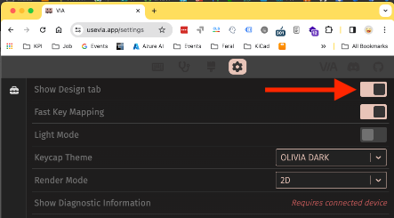
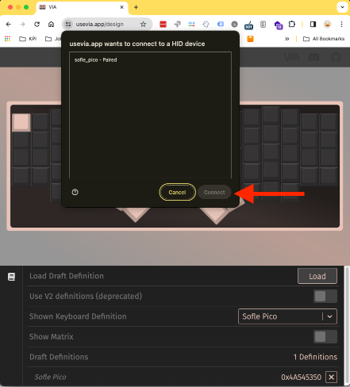

# Using VIA with Sofle Pico
Until the Sofle Pico layout is merged into the official VIA repo, you'll need to load the VIA definition manually.

Editing with VIA will only work after you've flashed the Sofle Pico at least once.
1. Visit https://usevia.app/
1. Open the "Settings" tab by clicking on the gear icon at the top of the page. 
1. Enable "Show Design tab".  

1. Now you should see a paintbrush icon at the top of the screen. Click on that to open the "Design tab".
1. Click "Load" to upload the file `via.json` file found in this repo at: `Sofle_Pico/Firmware/via.json`.

1. After the definition is loaded, you will be asked to authorize a connection to your device.  
1. Clicking on the "Configure" tab will let you modify your layout. 
